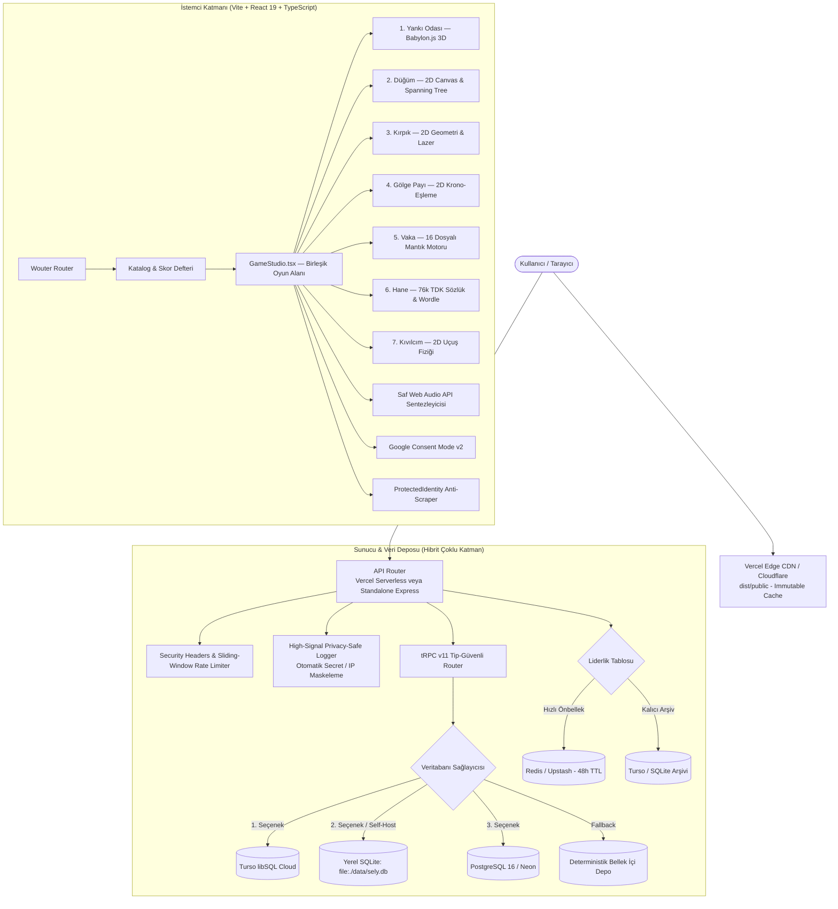

<div align="center">

# SELY.TR — MiniGame Hub

**Günlük prosedürel 7 mini oyun platformu: tek tohum ve ustalık sistemi, matematiksel çözülebilirlik güvencesi, risograph editoryal görsel dili, saf Web Audio osilatör sentezi ve sıfır takip çerezi.**

[](https://sely.tr)
[](LICENSE)
[](https://sely.tr)
[-brightgreen?style=flat-square&logo=vitest)](https://vitest.dev/)
[](https://www.typescriptlang.org/)

<br/>

Her sabah saat 00:00'da tüm dünya için tek bir günlük tohumdan (seed) deterministik olarak yeni bir "günün seti" üretilir. Oyuncunun ustalık seviyesi (1–4) arttıkça turlar karmaşıklaşır; ancak üretilen her labirent, akış rotası, çokgen kesimi ve dedektiflik delil grafı üretim anında **matematiksel çözücüler (BFS, Dijkstra, Spanning Tree, Evidence Graph Solvers)** tarafından taranarak **kesinlikle çözülebilir** olduğu doğrulanır.

[Canlı Oyna](https://sely.tr) • [Hızlı Başlangıç](#hızlı-başlangıç) • [Neden SELY?](#neden-sely-minigame-hub) • [Oyun Kataloğu](#oyun-kataloğu-ve-motor-mimarisi) • [Çözülebilirlik Güvenceleri](#matematiksel-çözülebilirlik-güvenceleri) • [Kontroller](#kontroller-ve-erişilebilirlik) • [Sistem Mimarisi](#sistem-mimarisi) • [Kurulum & Self-Host](#kurulum-ve-self-hosting) • [Ortam Değişkenleri](#ortam-değişkenleri) • [Gizlilik](#güvenlik-ve-gizlilik) • [Lisans](#lisans-ve-marka)

</div>

---

## Hızlı Başlangıç

Projeyi yerel makinenizde veya sunucunuzda 30 saniye içinde sıfır konfigürasyonla ayağa kaldırabilirsiniz:

### Docker Compose ile (Önerilen)
Harici veritabanı veya Redis gerekmez; yerel SQLite (`data/sely.db`) otomatik devreye girer:

```bash
git clone https://github.com/dixtuel/sely-minigame-hub.git
cd sely-minigame-hub
docker compose up -d
# http://localhost:3000 üzerinde hazırdır.
```

### Node.js / Bun ile
```bash
pnpm install && pnpm dev
# http://localhost:3000 üzerinde açılır.
```

---

## Neden SELY MiniGame Hub?

İnternet üzerindeki çoğu web oyunu ya agresif reklam ağlarıyla çevrelenmiş, kullanıcıyı kayıt olmaya zorlayan veya prosedürel seviye üretiminde imkânsız/çıkmaz durumları test etmeyen yüzeysel kopyalardan ibarettir. **SELY MiniGame Hub**, bağımsız web oyunculuğuna ve algoritmik bulmaca tasarımına alternatif bir mühendislik yaklaşımı sunar:

* **Deterministik ve Eşit Günlük Set:** Her sabah üretilen günlük set, tüm dünyadaki oyuncular için aynı tohumu paylaşır. Günlük rekabette şans faktörü asgari düzeye indirilir.
* **Sıfır İmkânsız Bölüm Garantisi:** "Rastgele" üretilen hiçbir seviye oyuncuya doğrudan sunulmaz. Arka plandaki matematiksel çözücüler bölümün geçerli bir çıkış yolu olduğunu kanıtlamadan tur başlamaz.
* **Sıfır Harici Ses Varlığı (Pure Web Audio):** Harici MP3 veya WAV varlıkları indirilmez. Tüm ses efektleri (tıklama, kesim, motor sesi, harmonik çanlar) tarayıcının yerel Web Audio API osilatörleriyle (`sine`, `sawtooth`, `triangle`, filtrelenmiş gürültü) gerçek zamanlı sentezlenir.
* **Radikal Veri Minimizasyonu:** Kayıt olma, parola girme veya e-posta bırakma zorunluluğu yoktur. Skorlar ve ustalık dereceleri yalnızca oyuncunun kendi tarayıcısında (`localStorage`) saklanır.
* **Risograph Editoryal Estetik:** 20. yüzyıl ortası bağımsız baskı atölyelerinden, kâğıt dokularından ve editoryal poster tipografisinden esinlenen özgün görsel kimlik.
* **Çift Dilli Altyapı:** Tarayıcı dilini otomatik tespit eden, tam yalıtımlı Türkçe (`/`) ve İngilizce (`/en`) rotaları.
* **Çift Çalışma Modu (Dual-Runtime):** İster Vercel Serverless + Edge CDN üzerinde küresel ölçekte sıfır maliyetle, ister kendi sunucunuzda (PC, VPS, VDS, Docker) sıfır konfigürasyonlu yerel SQLite ile çalıştırılabilir.

---

## Oyun Kataloğu ve Motor Mimarisi

Platformda yedi bağımsız mini oyun bulunur. Ortak paydaları; günlük tohum tabanı, 4 aşamalı ustalık sistemi ve yerel skor defteridir:

| Oyun | Tür | Motor | Doğrudan Erişim | Temel Mekanik |
| :--- | :--- | :--- | :--- | :--- |
| **Yankı Odası** | 3D Akustik Hayatta Kalma | Babylon.js 9 | [Oyna](https://sely.tr/?play=daily&game=echo) | Ekolokasyon, kör labirent, dinamik sis perdesi, akustik yapay zekâ |
| **Düğüm** | 2D Devre Akış Bulmacası | HTML5 Canvas | [Oyna](https://sely.tr/?play=daily&game=knot) | 4×4 boru ağı yönlendirme, DFS Spanning Tree, klavye mühürleme |
| **Kırpık** | 2D Geometri & Refleks | HTML5 Canvas | [Oyna](https://sely.tr/?play=daily&game=cut) | Rejection sampling çokgen katmanları, çift katmanlı lazer kesimi |
| **Gölge Payı** | 2D Zaman Gecikmeli Eşleme | HTML5 Canvas | [Oyna](https://sely.tr/?play=daily&game=shadow) | Geçmiş hareket tamponu simülasyonu, çift hedefli eşzamanlı kilit |
| **Vaka** | Dedektiflik & Mantık | State Machine | [Oyna](https://sely.tr/?play=daily&game=vaka) | 16 sinematik vaka, psikolojik stres, blöf/ters blöf, çelişki grafı |
| **Hane** | Kelime & Kod Çözümleme | Mantık / Metin | [Oyna](https://sely.tr/?play=daily&game=hane) | 4 haneli Mastermind ve 76 bin kelimelik TDK sözlük Wordle modu |
| **Kıvılcım** | 2D Arcade Uçuş Fiziği | Canvas + Web Audio | [Oyna](https://sely.tr/?play=daily&game=spark) | Delta-time bağımsız uçuş adımı, dinamik pilon aralıkları |

### 1. Yankı Odası (Echo Room)
* **Görsel ve Atmosfer:** Zifiri karanlık ortam, yalnızca oyuncunun ve düşmanın yaydığı ses dalgalarıyla aydınlanan duvarlar, hacimsel sis perdesi ve Poisson dağılımlı taş kemer gizli kapılar.
* **Akustik Düşman (The Umbral Stalker):** Konik obsidyen örtü, göğüs kafesinde parıldayan fasetli kristal çekirdek ve havada asılı 4 rezonans dikitinden oluşan 3D fantom varlık.
* **Dinamik Sonar:** Normal devriyede **5.2 saniyede bir**, oyuncu gürültü yaptığında veya tuzağa bastığında ise **2.8 saniyede bir** çift frekanslı kızıl akustik şok dalgası (`#ff1122` ve `#ff0055`) yayar.
* **Koridor Devriyesi:** Koridor BFS algoritması (`findMazePath`) ile 4 oda arasında 20–40 adımlık kapalı bir döngüde kesintisiz devriye gezer; duvara çarpıp kilitlenmez.
* **Çözücü Güvencesi:** Dijkstra minimum-gürültü çözücüsü (`echoMinimalNoise`), ideal 0-hatalı rotanın ses maliyetini hesaplayarak seviyenin ses bütçesini adil bir tolerans marjıyla belirler.

### 2. Düğüm (Knot)
* **Mekanik:** Randomized DFS Spanning Tree üzerinden yönlendirilen akış rotası. 16 karo döndürülerek kaynak (`S`) ile hedef (`H`/`T`) arasındaki enerji hattı birleştirilir.
* **Erişilebilirlik:** Ok tuşları veya WASD ile serbest karo seçimi, Boşluk/Enter ile döndürme, M ile akışı mühürleme ve Z ile hamle geri alma.
* **Çözücü Güvencesi:** Her seviye üretildikten sonra `isKnotLevelSolvable` BFS algoritması ile taranır (900/900 test tohumunda %100 çözülebilir).

### 3. Kırpık (Cutout)
* **Mekanik:** Rejection-sampling ile üretilen hareketli kâğıt katmanları. Sınırlı kesim enerjisiyle tehlikeli leke sınırlarına çarpmadan hedef şekilleri dilimleme.
* **Görsel Ayrıntı:** Çift katmanlı parıldayan lazer kılıcı, parçacık patlamaları ve klavye numaralarıyla (`[1]–[9]`) birebir eşleşen dairesel nişangah rozetleri.
* **Çözücü Güvencesi:** Çokgen alan doğrulayıcı, kesim hatlarının poligonları geçerli alanlara ayırdığını ve hedefin erişilebilir olduğunu onaylar.

### 4. Gölge Payı (Shadow Share)
* **Mekanik:** Oyuncunun hareket vektörlerini geçmiş tamponunda saklayan ve gecikmeli olarak yeniden oynatan spektral gölge. İki farklı basınç plakasını geçmişinizle senkronize biçimde aynı anda aktif etme zorunluluğu.
* **Çözücü Güvencesi:** Krono-simülasyon motoru, her iki hedefin eşzamanlı olarak tetiklenebilirliğini doğrular.

### 5. Vaka (Dedektiflik & Sorgu Odası)
* **16 Sinematik Dosya:** Boğaz Yalısı Kasa Soygunu, Siber Zirve Donanım Sızıntısı, Açık Deniz Yat Vurgunu, Kapadokya Balon Sabotajı, Göbeklitepe Kireçtaşı Mührü, F1 Telemetry Sabotajı, Michelin Mutfak Tarif Hırsızlığı vb.
* **Psikolojik Sorgu Mekaniği:**
  * Şüphelilerin 0–100 dinamik stres seviyesi, kademeli yalanları (Seviye 1–3) ve davranışsal ipuçları (terleme, göz kaçırma, savunmacı duruş).
  * **İki Yönlü Blöf:** Şüphelinin stresi düşükken (< 45) zamansız blöf yapıldığında şüpheli blöfü görür ve rahatlar (`stress -= 12`). Köşeye sıkıştığında (stres >= 45) yapılan blöf savunmasını çatlatır (`stress += 16`).
  * **İtiraf Güvencesi:** Düz sorular stresi en fazla 60'a çıkarabilir ve asla itiraf doğurmaz. Suçlunun itiraf etmesi için stresin kırılma eşiğini (80–86) aşması VE doğrudan çelişen delille yüzleştirilmesi şarttır.
* **Çözücü Güvencesi:** `solveVakaCase` bağımsız çözücüsü, delil grafından tekil suçlunun çıkarılabildiğini ve masumların tamamen aklandığını matematiksel olarak ispatlar.

### 6. Hane (Digits & Words)
* **Sayı Modu:** 4 haneli, rakamları tekrarsız Mastermind / Bulls & Cows mantığı. Tam yerinde (+) ve var ama yanlış yerde (-) anlık geri bildirimi.
* **Türkçe Sözlük Modu:** Günün kelimesi küratörlü havuzdan seçilirken, oyuncunun tahminleri 76.187 kelimelik tam TDK sözlüğünde (`ncarkaci/TDKDictionaryCrawler`) doğrulanır. Harf tekrarları Wordle kuralına uygun şekilde tekil tüketilir.
* **İngilizce Modu:** `/en` rotasında 5 harfli zengin İngilizce sözlük doğrulaması.

### 7. Kıvılcım (Spark)
* **Uçuş Fiziği:** Delta-time bağımsız yerçekimi ve darbe fiziği (`sparkPhysicsStep`), pilonlar arası dikey açıklık kısıtı (`maxDelta = 140` clamp) ve daire-AABB hibrit toleranslı çarpışma denetimi.
* **Harmonik Sentez:** Saf Web Audio API osilatörleriyle üretilen kanat çırpma, pilon geçiş çanı ve çarpışma sesleri.

---

## Matematiksel Çözülebilirlik Güvenceleri

SELY MiniGame Hub'ın temel ilkesi: **Hiçbir oyuncu imkânsız bir prosedürel tohum yüzünden oyunu kaybetmemelidir.**

| Oyun | Algoritmik Üretim Motoru | Doğrulama & Çözücü Algoritması | Çözülebilirlik Kapsamı |
| :--- | :--- | :--- | :--- |
| **Yankı Odası** | Recursive Backtracker + Braiding | Dijkstra En-Az-Gürültü Bütçesi (`echoMinimalNoise`) | Kilitli kapı anahtarlardan önce ulaşılamaz; rota garantili |
| **Düğüm** | Randomized DFS Spanning Tree | BFS Rota Ulaşılabilirlik Denetimi (`isKnotLevelSolvable`) | 900/900 test tohumunda %100 çözülebilir |
| **Kırpık** | Rejection Sampling Poligon Katmanları | Geometrik Çokgen Alan Doğrulayıcı | Hedef dilimlenebilirliği ve leke ayrımı doğrulanır |
| **Gölge Payı** | Çift Plakalı Topolojik Yerleşim | Zaman Tamponlu Çoklu-Tohum Simülasyonu | Eşzamanlı plaka kilidi doğrulanır |
| **Vaka** | Çift Yönlü İpucu-Şüpheli Grafı | Skor Tabanlı Çelişki Çözücüsü (`solveVakaCase`) | Tekil suçlu, tam aklanan masumlar |
| **Hane** | Deterministik Kelime/Sayı Havuzu | TDK Sözlük Doğrulayıcı & Frekans Sayacı | Tam TDK sözlük doğrulaması, çift harf sayımı engeli |
| **Kıvılcım** | Deterministik Tohumlu Pilon Üretimi | Sınırlanmış Delta-Time Uçuş Fiziği | Geçilebilir dikey koridor genişliği garantisi |

---

## Kontroller ve Erişilebilirlik

Platform hem masaüstü klavye donanımını hem de dokunmatik mobil cihazları birinci sınıf yurttaş olarak destekler:

| Oyun | Klavye Kısayolları | Dokunmatik / Mobil Etkileşim |
| :--- | :--- | :--- |
| **Yankı Odası** | <kbd>W</kbd><kbd>A</kbd><kbd>S</kbd><kbd>D</kbd> veya Ok Tuşları: Hareket<br/><kbd>Boşluk</kbd>: Yankı Dalgası Gönder | Sanal yön çubuğu ve dokunmatik nabız butonu |
| **Düğüm** | <kbd>W</kbd><kbd>A</kbd><kbd>S</kbd><kbd>D</kbd> veya Ok Tuşları: Karolar arası odaklanma<br/><kbd>Boşluk</kbd> / <kbd>Enter</kbd>: Çevir<br/><kbd>M</kbd>: Akışı Mühürle · <kbd>Z</kbd>: Geri Al | Karoya doğrudan dokunarak 90° çevirme, mobil mühürleme çubuğu |
| **Kırpık** | <kbd>1</kbd> – <kbd>9</kbd>: İlgili numaralı hedefi doğrudan dilimle | Parmağı tuval üzerinde sürükleyip bırakarak serbest lazer kesimi |
| **Gölge Payı** | <kbd>W</kbd><kbd>A</kbd><kbd>S</kbd><kbd>D</kbd> veya Ok Tuşları: Gezgin hareketi | Sanal yön oku kontrolleri |
| **Vaka** | <kbd>1</kbd> – <kbd>4</kbd>: Eylem sekmesi seçimi<br/><kbd>Boşluk</kbd>: Seçili sorgu eylemini uygula | Mobilde 4 sekmeli dokunmatik konsol, yatay kaydırmalı şüpheli kartları, alttan açılan mahkeme paneli |
| **Hane** | <kbd>A</kbd> – <kbd>Z</kbd> / <kbd>0</kbd> – <kbd>9</kbd>: Harf/rakam girişi<br/><kbd>Enter</kbd>: Tahmin gönder · <kbd>Backspace</kbd>: Sil | Ekran üzeri dokunmatik sanal klavye |
| **Kıvılcım** | <kbd>Boşluk</kbd> / <kbd>Yukarı Ok</kbd>: Kanat çırp / Yüksel | Ekrana herhangi bir noktadan tek dokunuş |

---

## Sistem Mimarisi



---

## Teknoloji Yığını

| Katman | Teknoloji | Sürüm | Mimari Görev ve Sorumluluk |
| :--- | :--- | :--- | :--- |
| **Kullanıcı Arayüzü** | React | `^19.0.0` | Concurrent React mimarisi, Suspense tembel yükleme, Context API |
| **3D Render Motoru** | Babylon.js | `^9.22.2` | Yankı Odası 3D labirent render'ı, özel materyaller, dinamik ışık |
| **Stil ve Tasarım** | Tailwind CSS | `^4.0.0` | Utility-first editoryal stil motoru, responsive düzenler |
| **Arayüz İlkelleri** | Radix UI | `^1.x / ^2.x` | WAI-ARIA uyumlu erişilebilir bileşenler (Dialog, Tooltip, Sonner) |
| **Vektörel Simgeler** | Lucide React | `^0.475.0` | Tutarlı ve hafif arayüz ikon seti |
| **İstemci Yönlendirme** | Wouter | `^3.5.0` | Minimalist (~1.5KB), bağımsızlıksız hashless router |
| **Uçtan Uca RPC** | tRPC | `^11.6.0` | İstemci ile sunucu arasında tam tip-güvenli RPC iletişimi |
| **Veritabanı Deposu** | PostgreSQL / libSQL | `pg / @libsql/client` | PostgreSQL (Neon/yerel) ve Turso / yerel SQLite (`sely.db`) çoklu depo |
| **Birim & Çözücü Testi** | Vitest | `^3.0.5` | 19 test dosyasında 107 test ve 14.300'den fazla doğrulama |
| **Paketleyici & HMR** | Vite & esbuild | `^6.1.0` | Hızlı HMR, istemci optimizasyonu ve serverless derleme |
| **Çalışma Ortamı** | Node.js / Bun | `Node 22 LTS / Bun 1.x` | Canlıda Node.js 22 LTS; yerel geliştirmede ultra hızlı Bun |

---

## Kurulum ve Self-Hosting

SELY MiniGame Hub, **Vercel Serverless** üzerinde sıfır maliyetle çalışabildiği gibi; dileyen herkesin kendi **PC, VPS, VDS veya Docker** sunucusunda **%100 bağımsız ve sıfır konfigürasyonla** host edebileceği şekilde tasarlanmıştır.

### 1. Yerel Geliştirme (Local Development)

```bash
# Depoyu klonlayın
git clone https://github.com/dixtuel/sely-minigame-hub.git
cd sely-minigame-hub

# Bağımlılıkları yükleyin (pnpm veya Bun)
pnpm install
# ya da: bun install

# Geliştirme sunucusunu başlatın
pnpm dev
# http://localhost:3000 üzerinde açılır
```

#### Doğrulama ve Test Paketini Çalıştırın
```bash
# TypeScript katı tip denetimi
pnpm check

# Çözücü ve birim test paketi (19 dosya, 107 test, 14.3k+ assertion)
pnpm test

# Kamuya açık dağıtım sızıntı denetimi
pnpm audit:public
```

---

### 2. Kendi Sunucunda Host Etme (Self-Hosting)

#### Seçenek A: Docker Compose ile Tek Komutla Kurulum
Herhangi bir harici veritabanı veya Redis kurmanıza gerek yoktur. Yerel SQLite (`./data/sely.db`) otomatik olarak devreye girer:

```bash
# 1. Örnek ortam değişkenlerini kopyalayın (isteğe bağlı)
cp .env.example .env

# 2. Container'ı arka planda başlatın
docker compose up -d

# Uygulama http://localhost:3000 üzerinde kullanıma hazırdır!
```

#### Seçenek B: Standalone Node.js / Bun Sunucusu
```bash
# 1. Bağımlılıkları kurun ve derleyin
pnpm install
pnpm build

# 2. Üretim sunucusunu başlatın
pnpm start
# http://localhost:3000 üzerinde hem statik varlıklar hem de API sunulur.
```

* **Sıfır Konfigürasyon SQLite:** Harici PostgreSQL veya Turso tanımlanmazsa, sunucu verileri otomatik olarak `./data/sely.db` yerel SQLite dosyasında kalıcılaştırır.
* **Otomatik İçerik Hazırlığı (Pre-warm):** Standalone sunucu başladığında günün oyun içerikleri deterministik olarak önceden üretilir ve önbelleğe alınır.
* **Yüksek Sinyalli Gizlilik Odaklı Loglar:** IP adresleri ve veritabanı şifreleri loglarda otomatik maskelenir; gereksiz bilgi gürültüsü engellenir.

---

### 3. Vercel Dağıtımı (Serverless & Global Edge CDN)

Projeyi tek tıkla Vercel üzerine deploy edebilirsiniz:

[](https://vercel.com/new/clone?repository-url=https%3A%2F%2Fgithub.com%2Fdixtuel%2Fsely-minigame-hub)

---

## Ortam Değişkenleri

Tüm ortam değişkenleri **opsiyoneldir**. Herhangi bir değişken tanımlanmadığında sistem yerel SQLite veya bellek-içi tohum üretimiyle sorunsuz çalışır:

```bash
cp .env.example .env
```

#### Veritabanı — Günlük İçerik & Skor Arşivi

| Değişken | Varsayılan | Açıklama |
| :--- | :---: | :--- |
| `TURSO_DATABASE_URL` | `file:./data/sely.db` | Turso / libSQL bağlantı dizesi. Self-host modunda otomatik yerel SQLite dosyası (`file:./data/sely.db`) kullanılır. Bulut için [turso.tech](https://turso.tech) libSQL URL'i (`libsql://...`) girilebilir. |
| `TURSO_AUTH_TOKEN` | `undefined` | Turso Cloud yetkilendirme anahtarı (Yerel `file:...` modunda gerekmez). |
| `DATABASE_URL` | `undefined` | PostgreSQL 16 bağlantı dizesi (Neon veya yerel Postgres). |

#### Redis — Liderlik Tablosu Önbelleği

| Değişken | Varsayılan | Açıklama |
| :--- | :---: | :--- |
| `REDIS_URL` | `undefined` | ioredis uyumlu standart Redis (`redis://...`) veya Upstash Redis. Tanımsızsa Turso/SQLite arşivi veya bellek-içi önbellek kullanılır. 48 saatlik TTL ile otomatik süpürülür. |

#### Güvenlik — Zamanlanmış Görev (Cron) Yetkilendirmesi

| Değişken | Varsayılan | Açıklama |
| :--- | :---: | :--- |
| `CRON_SECRET` | `undefined` | Vercel Cron'un gönderdiği `Authorization: Bearer <değer>` başlığıyla doğrulanır. |
| `DAILY_JOB_TOKEN` | `undefined` | Sunucu crontab'ının gönderdiği `x-sely-cron-token` başlığıyla doğrulanır. |

#### Vercel & İzleme

| Değişken | Varsayılan | Açıklama |
| :--- | :---: | :--- |
| `GLOBAL_CONFIG_ID` | `undefined` | Vercel Edge Config mağaza kimliği (Deploy atmadan duyuru banner'ı veya bakım modu kontrolü). |
| `VITE_ENABLE_VERCEL_ANALYTICS` | `false` | Vercel Web Analytics'i etkinleştirir (`true`/`false`). Sıfır çerezli gizlilik dostudur. |
| `VITE_ENABLE_VERCEL_SPEED_INSIGHTS` | `false` | Core Web Vitals RUM takibini etkinleştirir (`true`/`false`). |

---

## Güvenlik ve Gizlilik

* **Radikal Veri Minimizasyonu:** Oyuncuların kişisel bilgileri, e-postaları veya parolaları toplanmaz. Tüm başarı ve skor verileri oyuncunun kendi cihazındaki `localStorage` alanında kalır.
* **Sıfır İzinsiz Takip Çerezi:** Varsayılan durumda hiçbir analiz veya reklam çerezi yerleştirilmez.
* **Google Consent Mode v2:** `ad_storage`, `ad_personalization` ve `analytics_storage` izinleri varsayılan olarak `denied` durumundadır. Kullanıcı onay verdiğinde sinyaller dinamik olarak güncellenir; Footer'daki "Çerez Ayarları" üzerinden her an geri çekilebilir.
* **Anti-Scraper Kimlik Koruması (`ProtectedIdentity`):** İletişim e-posta adresi ve veri sorumlusu adı kaynak kodda veya ham HTML'de düz metin olarak yer almaz. Çalışma zamanında karakter dizilerinden çözülür; DOM üzerindeki görünmez tuzak elemanlarıyla (`.bot-decoy`) otomatik e-posta toplayıcı botlar yanıltılır.
* **Yüksek Sinyalli Gizlilik Odaklı Günlükleme (`logger.ts`):** Veritabanı bağlantı dizesindeki şifreler, kimlik doğrulama token'ları ve IP adresleri loglarda otomatik maskelenir. Normal anonim ziyaretçiler için uyarı üretilmez, Vercel log kotaları korunur.
* **Otomatik `audit:public` CI Kapısı:** Her dağıtım öncesinde depoda hiçbir gizli anahtar, doğrulama dosyası veya kişisel kimlik sızıntısı kalmadığı otomatik olarak denetlenir (`pnpm audit:public`).

---

## Açık Kaynak Atıfları

Babylon.js, React, Tailwind CSS, Lucide simgeleri, Radix UI, tRPC, PostgreSQL, libSQL ve TDK Türkçe sözlük tarayıcısının açık kaynak lisans bildirimleri için **[ATTRIBUTION.md](ATTRIBUTION.md)** belgesini inceleyebilirsiniz.

---

## Lisans ve Marka

Bu deponun kaynak kodları **[GNU Affero General Public License v3.0](LICENSE)** (AGPL-3.0) kapsamında sunulmaktadır. Değiştirilmiş veya ağ üzerinden hizmet sunan türevlerin de aynı AGPL-3.0 koşullarıyla kaynak kodunu kamuya açık kılması şarttır.

`SELY.TR`, `dixtuel` markası, özgün oyun logoları, risograph stil varlıkları ve oyun konseptleri **dixtuel (SELY.TR)** mülkiyetindedir. Telif hakkı **© 2026 dixtuel**.
