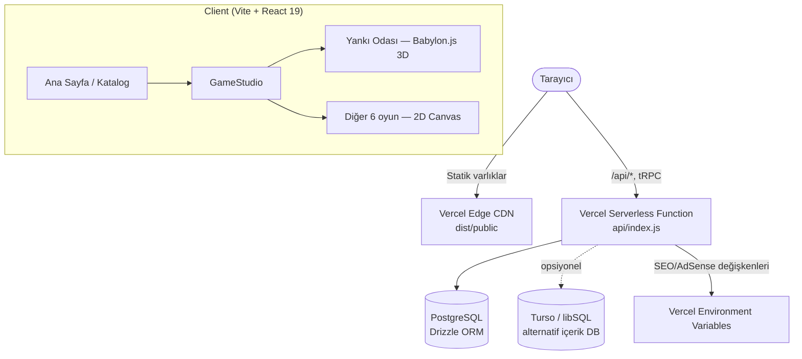

<div align="center">

# SELY.TR — MiniGame Hub

**Günlük prosedürel mini oyun hub'ı: 7 bağımsız oyun, tek ustalık/skor sistemi, tek editoryal görsel dil.**

[](https://sely.tr)
[](LICENSE)
[](https://sely.tr)
[](https://www.babylonjs.com/)

Her sabah her oyun için yeni bir "günün seti" üretilir; dünkü set kataloğu terk eder. Ustalık (mastery) puanın yükseldikçe aynı oyunun sonraki turu daha yoğun/karmaşık bir rota üretir — ama her rota, üretilirken ayrıca çözülebilirliği doğrulanır.

[Canlı Demo](https://sely.tr) • [Oyunlar](#oyunlar) • [Mimari](#mimari) • [Yerel Geliştirme](#yerel-geliştirme) • [Dağıtım](#dağıtım-vercel) • [Ortam Değişkenleri](#ortam-değişkenleri)

</div>

---

## Oyunlar

Görsel dil; editoryal poster tasarımı, kâğıt yüzeyleri ve baskı atölyesi ritminden oluşur. Yedi oyun bağımsız çalışır, ortak olan yalnız günlük seed/mastery sistemi ve skor defteridir.

| Oyun | Motor | Kısa açıklama |
|---|---|---|
| **Yankı Odası** | Babylon.js (gerçek 3D) | Gerçek hücre-tabanlı bir labirentte yankı darbeleriyle yolu aç, 3 işareti topla, kilitli mührü aç ve dinleyiciden kaçarak çıkışa ulaş. |
| Düğüm | 2D Canvas | Dönen karoları bağlayarak akışı kaynaktan hedefe ulaştır. |
| Kırpık | 2D Canvas | Sınırlı kesim enerjisiyle hareketli kâğıt katmanlarını temizle. |
| Gölge Payı | 2D Canvas | Gecikmeli gölgeni iki pedde eşleştirip çıkışı yakala. |
| Vaka | Metin/mantık | Şüpheliyi suçla, ifadesiyle çelişen ipucunu sun — yanlış ipucu davayı kapatmaz. |
| Hane | Metin/mantık | Sayı veya kelime kaydını dene, makbuz işaretleriyle her satırda ihtimalleri daralt. |
| Kıvılcım | 2D Canvas (sonsuz) | Sonsuz trafikte planörü yönet, her zaman açık olan şeridi zamanında yakala. |

Yankı Odası, projedeki tek gerçek-3D oyundur: `@babylonjs/core` üzerinde recursive-backtracker ile üretilen gerçek dallanan/çıkmaz sokaklı bir labirent, eksen-ayrık duvar çarpışması, `mastery`'ye göre ayarlanan zorluk (braiding), dinamik ışık/gölge ve yankı-dalgası tabanlı bir "sis perdesi" (fog-of-war) mekaniği kullanır.

## Mimari



- **Build:** Vite (client, statik `dist/public`) + esbuild (`server/_core` → `dist/index.js`, `server/serverless.ts` → `api/index.js`).
- **Sunum:** Vercel Edge CDN statik varlıkları sunar; `/api/*`, `ads.txt`, `robots.txt`, `sitemap.xml`, arama motoru doğrulama dosyaları ve tRPC uçları tek bir Serverless Function'a (`api/index.js`) rewrite edilir (bkz. `vercel.json`).
- **Veritabanı:** Birincil olarak Postgres + Drizzle ORM (`DATABASE_URL`); günlük içerik için isteğe bağlı Turso/libSQL sağlayıcısına da geçilebilir (`CONTENT_DB_PROVIDER=turso`). `DATABASE_URL` tanımlı değilse uygulama skor/günlük-içerik kalıcılığı olmadan da ayağa kalkar.
- **Test:** Vitest — her oyunun seviye üreticisi, çok sayıda seed/mastery kombinasyonunda **her zaman çözülebilir** olduğunu doğrulayan stres testleriyle korunur (`client/src/lib/levelGenerators.test.ts`, `client/src/game/maze.test.ts`).
- **Gizlilik sınırı:** `npm run audit:public` — commit'ten önce gerçek iletişim adresi, arama motoru doğrulama dosyaları veya kimlik-bağlama yapılarının repoya sızmadığını denetler (bkz. [Public / production sınırı](#public--production-sınırı)).

## Yerel Geliştirme

```bash
git clone https://github.com/dixtuel/sely-minigame-hub.git
cd sely-minigame-hub
pnpm install   # ya da: bun install
pnpm dev       # http://localhost:3000
```

Geliştirme/CI adımlarında (`install`, `check`, `test`, `build`) [Bun](https://bun.sh) da kullanılabilir — Node 22 LTS ile birebir uyumlu, belirgin şekilde daha hızlı:

```bash
bun install && bun run check
```

### Kontrol

```bash
pnpm check   # tsc --noEmit
pnpm test    # vitest run
pnpm build   # vite build + esbuild (server + api)
```

## Dağıtım (Vercel)

Canlı ortam (`sely.tr`) `vercel.json` üzerinden yapılandırılmıştır — `buildCommand`, statik/immutable cache header'ları ve `/api`, `ads.txt`, `robots.txt`, `sitemap.xml`, arama motoru doğrulama dosyaları için Serverless Function rewrite'ları dahil. Kendi Vercel projenizde:

```bash
vercel link
vercel env add DATABASE_URL production
vercel deploy --prod
```

## Ortam Değişkenleri

Tam liste `server/_core/env.ts` ve `server/dailyContent.ts` içinde okunur; en çok dokunacağınız olanlar:

| Değişken | Zorunlu | Açıklama |
| :--- | :---: | :--- |
| `DATABASE_URL` | Hayır | Postgres bağlantı dizesi. Tanımsızsa uygulama skor/günlük-içerik kalıcılığı olmadan çalışır. |
| `CONTENT_DB_PROVIDER` | Hayır | `turso` verilirse günlük içerik Postgres yerine Turso/libSQL'den okunur (`TURSO_URL`, `TURSO_AUTH_TOKEN` gerekir). |
| `PORT` | Hayır | Node.js sunucu portu (yerel geliştirmede varsayılan `3000`). |
| `PRIMARY_DOMAIN` / `VITE_PRIMARY_DOMAIN` | Hayır | Kanonik alan adı — SEO meta etiketleri ve sitemap için. |
| `GOOGLE_SITE_VERIFICATION`, `BING_SITE_VERIFICATION`, `YANDEX_SITE_VERIFICATION` | Hayır | Arama motoru doğrulama meta etiketleri/dosyaları, ortam değişkeninden dinamik üretilir (repoya statik dosya olarak eklenmez). |
| `ADS_TXT` / `VITE_ADS_TXT` | Hayır | `ads.txt` içeriği, ortam değişkeninden dinamik servis edilir. |

`JWT_SECRET`, `OAUTH_SERVER_URL`, `OWNER_OPEN_ID`, `DAILY_JOB_TOKEN` gibi değişkenler yönetilen günlük-içerik/oturum arka ucuna özeldir; temel self-host/geliştirme akışı için gerekmez.

## Public / production sınırı

Production ortam değişkenleri, gerçek iletişim bilgileri, arama motoru doğrulama dosyaları ve ajana özel çalışma notları bu depoda bulunmaz — `npm run audit:public` bunu commit öncesi otomatik denetler.

## Lisans ve marka

Kaynak kodu [GNU Affero General Public License v3.0](LICENSE) kapsamında sunulur. Bu lisans, değiştirilmiş veya ağ üzerinden kullanıma sunulan türevlerin de aynı AGPL-3.0 koşullarıyla kaynak kodunu erişilebilir kılmasını gerektirir.

`SELY.TR`, `dixtuel` adı, logolar, oyun adları ve marka kimliği AGPL-3.0 ile ayrı bir marka lisansı kazanmaz; bu işaretler, onay veya ilişki ima edecek biçimde kullanılamaz. Telif hakkı **© 2026 Asrın Kılıç (dixtuel).**
