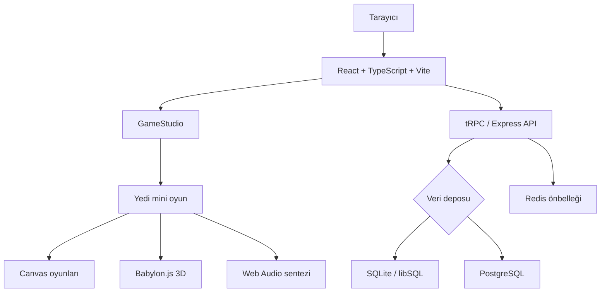

<div align="center">

# SELY.TR — MiniGame Hub

**Tarayıcıda oynanan yedi kısa oyun. Her gün yeni bir set. Her seviye deterministik, her rota çözülebilir.**

[](https://sely.tr)
[](LICENSE)
[](https://nodejs.org/)
[](https://www.typescriptlang.org/)
[](https://vitest.dev/)

[**Canlı demoyu aç**](https://sely.tr) · [**Oyun kataloğuna git**](#oyun-katalo%C4%9Fu) · [**Yerel çalıştır**](#h%C4%B1zl%C4%B1-ba%C5%9Flang%C4%B1%C3%A7)

</div>

---

## Sely nedir?

SELY.TR, birkaç dakikada oynanabilen yedi mini oyunu tek bir günlük deneyimde birleştiren açık kaynaklı bir web oyun platformudur. Oyuncu her gün aynı temel seed’den üretilen seti görür. Kişisel ustalık seviyesi yükseldikçe oyunlar daha yoğun hâle gelir; fakat prosedürel üretimden çıkan her seviye, oyuncuya sunulmadan önce ilgili doğrulama veya çözücü katmanından geçer.

Proje iki hedefi birlikte taşır: oyuncu için hızlı, reklamsız ve kimlik istemeyen bir deneyim; geliştirici için ise React, TypeScript, Canvas, Babylon.js, Web Audio ve tip güvenli bir sunucu katmanını aynı üründe gösteren sürdürülebilir bir örnek.

## Öne çıkan özellikler

- **Yedi farklı oyun:** 3D keşif, akış bulmacası, geometri, zamanlama, dedektiflik, kelime-mantık ve arcade uçuş türleri.

- **Günlük deterministik içerik:** Aynı günün temel seti oyuncular arasında paylaşılır; içerik seed tabanlı üretilir.

- **Çözülebilirlik kontrolleri:** BFS, Dijkstra, spanning tree, geometri doğrulama ve vaka çözücüleri imkânsız prosedürel seviyeleri filtreler.

- **Dört aşamalı ustalık sistemi:** Oyuncunun yüksek skoruna göre tekrar oynanabilirlik ve zorluk artar.

- **Masaüstü ve mobil kontroller:** Klavye, fare, dokunmatik etkileşim ve oyun bazlı sanal kontroller.

- **Türkçe ve İngilizce rotalar:** Türkçe kök rota ve İngilizce `/en` rotası.

- **Saf Web Audio efektleri:** Oyun içi kısa sesler tarayıcıda sentezlenir; oyunun temel sesi için harici ses dosyası zorunlu değildir.

- **Anonim kullanım:** Kullanıcı hesabı veya parola gerektirmez. Yerel ilerleme tarayıcıda tutulur; liderlik tablosu API üzerinden isteğe bağlı olarak çalışır.

- **Çift dağıtım modeli:** Vercel Serverless veya Docker/Node.js ile kendi sunucunda çalıştırılabilir.

- **Esnek veri katmanı:** Harici servis tanımlanmadığında yerel SQLite ve bellek içi fallback seçenekleriyle başlar.

## Oyun kataloğu

| Oyun | Tür | Temel fikir | Yaklaşık süre |
| --- | --- | --- | --- |
| **Yankı Odası / Echo Room** | 3D keşif ve risk | Karanlık bir labirentte yankı bütçesini koruyarak işaretleri topla. | 3–5 dk |
| **Düğüm / Knot** | Akış bulmacası | Karoları çevirerek kaynağı hedefe bağlayan akışı kur. | 1–3 dk |
| **Kırpık / Cutout** | Geometri ve ritim | Hareketli şekilleri sınırlı enerjiyle tek çizgide kes. | 90 sn |
| **Gölge Payı / Shadow Share** | Zamanlama ve eşleme | Gecikmeli gölgeni iki hedefle eşzamanla. | 2 dk |
| **Vaka / Case** | Dedektiflik ve çıkarım | Şüpheliyi, ifadesiyle çelişen kanıtı sunarak sıkıştır. | 3–5 dk |
| **Hane / Hane** | Kelime ve sayı mantığı | Sayı veya kelime kayıtlarındaki işaretleri kullanarak seçenekleri azalt. | 2–4 dk |
| **Kıvılcım / Spark** | Arcade uçuş | Kıvılcımı engeller arasında tut ve mümkün olduğunca uzun uç. | Sonsuz uçuş |

Oyunların kullanıcıya gösterilen başlıkları ve kontrolleri `client/src/lib/catalog.ts` içinde tek katalogdan yönetilir. İngilizce metinler aynı katalogdaki locale eşlemesiyle üretilir.

## Tasarım ve teknik yaklaşım

### Günlük seed ve ustalık

Günlük içerik, tarih ve oyun kimliğinden türetilen deterministik seed’lerle oluşturulur. Böylece aynı günün temel seviyesi yeniden üretilebilir ve oyuncular aynı günlük yapıyı paylaşabilir. Kişisel skor, ustalık hesabında kullanılır; bu nedenle tekrar oynama yalnızca yeni rastgelelik aramak yerine daha iyi bir çözüm ve daha yüksek performans arayışına dönüşür.

### Çözülebilirlik güvencesi

Prosedürel üretim tek başına yeterli kabul edilmez. Oyunların ilgili üretim ve doğrulama katmanları aşağıdaki yaklaşımı kullanır:

| Oyun | Üretim yaklaşımı | Doğrulama yaklaşımı |
| --- | --- | --- |
| Yankı Odası | Labirent üretimi ve koridor bağlantıları | BFS rota kontrolü ve minimum gürültü için Dijkstra |
| Düğüm | Rastgeleleştirilmiş DFS spanning tree | BFS ile kaynak-hedef erişilebilirlik kontrolü |
| Kırpık | Rejection sampling ile çokgen katmanları | Geometrik alan ve kesilebilirlik doğrulaması |
| Gölge Payı | Gecikmeli hareket ve çift hedef yerleşimi | Zaman tamponu simülasyonu |
| Vaka | İpucu-şüpheli ilişkileri ve vaka state machine’i | Tekil suçlu ve çelişki grafı çözümü |
| Hane | Deterministik kelime ve sayı havuzları | Sözlük ve frekans doğrulaması |
| Kıvılcım | Seed tabanlı engel ve fizik üretimi | Geçilebilir açıklık ve delta-time kısıtları |

## Hızlı başlangıç

### Gereksinimler

- Node.js **22 LTS**

- pnpm **10.4.1** veya uyumlu pnpm 10 sürümü

- Yerel geliştirme için modern bir masaüstü ya da mobil tarayıcı

### Kurulum

```bash
git clone https://github.com/dixtuel/sely-minigame-hub.git
cd sely-minigame-hub
pnpm install
pnpm dev
```

Geliştirme sunucusu varsayılan olarak [http://localhost:3000](http://localhost:3000) adresinde açılır.

İlk kurulumda ortam değişkeni zorunlu değildir. İhtiyaç duyarsan örnek dosyayı kopyalayabilirsin:

```bash
cp .env.example .env
```

### Üretim derlemesi

```bash
pnpm build
pnpm start
```

`pnpm build` istemciyi Vite ile, standalone sunucuyu ve Vercel serverless girişini esbuild ile üretir. `pnpm start`, derlenmiş standalone sunucuyu başlatır.

## Geliştirme komutları

| Komut | Açıklama |
| --- | --- |
| `pnpm dev` | Geliştirme sunucusunu ve dosya izlemeyi başlatır. |
| `pnpm check` | TypeScript tip kontrolünü çalıştırır. |
| `pnpm test` | Vitest testlerini çalıştırır. |
| `pnpm audit:public` | Public release içinde hassas dosya ve bilgi sızıntısı arar. |
| `pnpm build` | Vite, standalone Node.js ve serverless üretim çıktısını oluşturur. |
| `pnpm start` | Üretim derlemesini standalone sunucu olarak çalıştırır. |
| `pnpm format` | Prettier ile kaynak biçimlendirmesi yapar. |

Değişiklik göndermeden önce en azından şu doğrulama paketini çalıştırmanı öneririm:

```bash
pnpm check
pnpm test
pnpm audit:public
pnpm build
```

## Dağıtım seçenekleri

### Vercel

Repo, `vercel.json` içindeki rewrite ve header kurallarıyla Vercel Serverless dağıtımına hazırdır. Tek tıklık kurulum için:

[](https://vercel.com/new/clone?repository-url=https%3A%2F%2Fgithub.com%2Fdixtuel%2Fsely-minigame-hub)

Vercel kullanırken API route’ları, paylaşım sayfaları, SEO dosyaları ve statik istemci aynı deployment üzerinden servis edilir.

### Docker Compose

Docker kurulumu, uygulama ile Redis’i birlikte başlatır. Harici veritabanı veya Redis vermediğinde uygulama yerel fallback seçeneklerini kullanabilir.

```bash
cp .env.example .env
docker compose up -d
```

Uygulama [http://localhost:3000](http://localhost:3000) adresinde çalışır. Kalıcı veriler `sely-data` ve `redis-data` volume’larında tutulur.

### Standalone Node.js

```bash
pnpm install
pnpm build
pnpm start
```

Harici veritabanı tanımlanmadığında standalone modda `file:./data/sely.db` yerel SQLite yolu kullanılabilir. Bu davranışın ayrıntıları için `.env.example` dosyasına bak.

## Ortam değişkenleri

Tüm değişkenler zorunlu değildir. En güncel açıklamalar ve örnek değerler [`.env.example`](.env.example) içinde tutulur.

| Alan | Değişkenler | Ne için kullanılır? |
| --- | --- | --- |
| Veri deposu | `TURSO_DATABASE_URL`, `TURSO_AUTH_TOKEN`, `DATABASE_URL` | Turso/libSQL, yerel SQLite veya PostgreSQL bağlantısı |
| Önbellek | `REDIS_URL` | Liderlik tablosu önbelleği ve TTL yönetimi |
| Zamanlanmış işler | `CRON_SECRET`, `DAILY_JOB_TOKEN` | Vercel Cron veya sunucu crontab yetkilendirmesi |
| Vercel | `GLOBAL_CONFIG_ID` | Duyuru banner’ı ve bakım modu gibi global ayarlar |
| İzleme | `VITE_ENABLE_VERCEL_ANALYTICS`, `VITE_ENABLE_VERCEL_SPEED_INSIGHTS`, `VITE_VERCEL_SPEED_INSIGHTS_SAMPLE_RATE` | İsteğe bağlı ölçüm ve Core Web Vitals takibi |
| SEO | `GOOGLE_SITE_VERIFICATION`, `BING_SITE_VERIFICATION`, `YANDEX_SITE_VERIFICATION` | Arama motoru doğrulama dosyaları |
| Reklam | `VITE_ADSENSE_CLIENT_ID`, `VITE_ADSENSE_RESULT_SLOT_ID` | Tanımlıysa reklam bileşenini etkinleştirme |
| Genel | `PRIMARY_DOMAIN` | Canonical URL ve sunucu ortamı için ana alan adı |

## Mimari genel görünüm



### Dizin yapısı

```
client/       React arayüzü, sayfalar, bileşenler ve oyun render katmanı
server/       Express/tRPC API, veri erişimi, günlük içerik ve SEO route’ları
shared/       İstemci ve sunucu arasında paylaşılan tipler ve vaka verileri
api/          Vercel serverless girişleri ve paylaşım/OG endpoint’leri
scripts/      Public release denetimleri ve veri hazırlama script’leri
client/public/Statik görseller, posterler, dokular ve ses varlıkları
```

## Veri ve gizlilik

Sely varsayılan olarak hesap, parola veya e-posta istemeden oynanabilir. Yerel ilerleme ve kişisel oyun durumu tarayıcı tarafında tutulur. Liderlik tablosu gibi sunucu özellikleri etkinleştirildiğinde veri deposu yapılandırmasına göre API üzerinden çalışır.

İzleme ve reklam entegrasyonları varsayılan olarak kapalıdır. Analytics, Speed Insights ve AdSense değişkenleri ayrıca etkinleştirilmedikçe ilgili bileşenler çalışmaz. Public release denetimi `pnpm audit:public` komutuyla hassas dosya ve bilgi sızıntılarını kontrol eder.

## Katkıda bulunma

Hata bildirmek, yeni bir oyun fikri önermek veya mevcut bir mekaniği geliştirmek için [issue](https://github.com/dixtuel/sely-minigame-hub/issues) açabilirsin. Kod değişikliklerinde şu akış önerilir:

1. Repo’yu fork’la veya bir feature branch oluştur.

1. Değişikliği küçük ve tek amaçlı tut.

1. `pnpm check`, `pnpm test`, `pnpm audit:public` ve `pnpm build` komutlarını çalıştır.

1. Değişikliğin oyun davranışını veya veri sözleşmesini etkilediğini açıklayan bir Pull Request gönder.

Yeni bir oyun eklerken katalog kaydını, İngilizce metin eşlemesini, oyun bileşenini, kontrolleri, testleri ve gerekiyorsa solver doğrulamasını birlikte güncelle.

## Atıflar

Kullanılan açık kaynak bileşenler ve üçüncü taraf içerik bildirimleri [docs/ATTRIBUTION.md](docs/ATTRIBUTION.md) dosyasında listelenir. Başlıca teknik bileşenler [React](https://react.dev/), [Babylon.js](https://www.babylonjs.com/), [Vite](https://vite.dev/), [tRPC](https://trpc.io/), [Vitest](https://vitest.dev/), [Tailwind CSS](https://tailwindcss.com/) ve [Radix UI](https://www.radix-ui.com/).

## Lisans ve marka

Kaynak kodu [GNU Affero General Public License v3.0](LICENSE) kapsamında lisanslanır.

`SELY.TR`, `dixtuel` markası, özgün oyun adları, oyun konseptleri, logoları ve görsel kimlik varlıkları ayrıca korunur. Telif hakkı © 2026 dixtuel.


