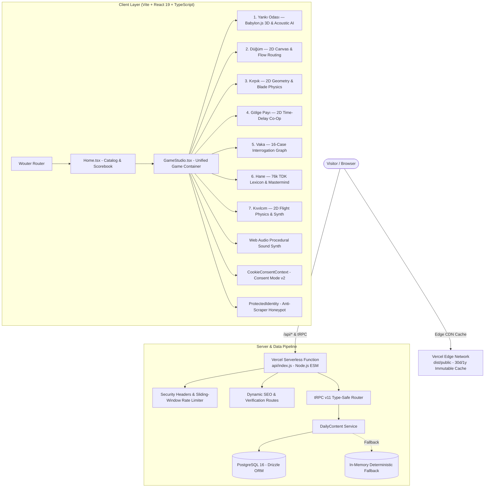

<div align="center">

# SELY.TR — MiniGame Hub

**A daily procedural puzzle and mini-game suite with 7 distinct algorithmic challenges, unified mastery progression, risograph editorial aesthetic, and radical privacy.**

[](https://sely.tr)
[](LICENSE)
[](https://sely.tr)
[](https://www.babylonjs.com/)
[-brightgreen?style=for-the-badge&logo=vitest)](https://vitest.dev/)
[](https://www.typescriptlang.org/)

<br/>

Every morning, a synchronized "Daily Edition" is deterministically generated for each game from a shared daily seed. As your mastery tier climbs from 1 to 4, generation scales in complexity. Every single maze, circuit, polygon, and crime evidence graph is verified in-memory by **mathematical solvers (BFS, Dijkstra, Spanning Tree, Evidence Graph Solvers)** before being served — guaranteeing **100% solvability without guesswork**.

[Live Demo](https://sely.tr) • [Game Catalog](#-the-mini-game-roster) • [Mathematical Solvers](#-mathematical-solvers--guarantees) • [Architecture](#-system-architecture) • [Tech Stack](#-technology-stack) • [Security & Privacy](#-security-privacy--anti-scraping) • [Development](#-local-development) • [Attributions](#-open-source-attributions)

</div>

---

## ✨ Core Highlights

- 🌅 **Daily Deterministic Seeded Editions:** A unified daily seed guarantees that every player worldwide faces the exact same daily edition, resetting at midnight.
- 🧮 **Mathematical Solvability Guarantees:** Zero broken or impossible seeds. In-memory solvers verify paths, graph solvability, and contradiction uniqueness before level presentation.
- 🎨 **Risograph Editorial Visual Language:** Inspired by mid-century print shops, textured paper surfaces, chromatic aberration accents, and bold typographic poster grids.
- 🔊 **Zero-Asset Web Audio Synthesizer:** Pure procedural audio synthesis using native Web Audio API oscillators (`sine`, `sawtooth`, `triangle`, filtered noise) — zero heavy MP3/WAV downloads.
- 🛡️ **Radical Privacy & Zero Trackers:** Client-side local scorebook (`localStorage`), zero forced logins, Google Consent Mode v2 compliance with default-denied storage, and honeypot anti-scraping traps.
- ⌨️ **Keyboard & Mobile-First Controls:** Full desktop keyboard support (WASD / Arrow navigation, 1-9 direct targeting, space/enter triggers) and dedicated touch-optimized segmented consoles.
- 🌐 **Seamless Bilingual Internationalization:** Full Turkish (`/`) and English (`/en`) localization across all UI, dossiers, tutorials, and game logic with browser auto-detection.

---

## 🎮 The Mini-Game Roster

Seven completely distinct mini-games, each powered by dedicated mathematical algorithms, rendering pipelines, and solver suites:

```
┌─────────────────────────────────────────────────────────────────────────────┐
│                             SELY MINIGAME HUB                               │
├───────────────────┬───────────────────┬───────────────────┬─────────────────┤
│ 1. YANKI (ECHO)   │ 2. DÜĞÜM (KNOT)   │ 3. KIRPIK (CUT)   │ 4. GÖLGE (SHADOW│
│ 3D Acoustic Stalk │ 2D Pipe Flow DFS  │ Geometry Slicing  │ Time-Delay Co-Op│
├───────────────────┼───────────────────┼───────────────────┼─────────────────┤
│ 5. VAKA (MYSTERY) │ 6. HANE (DIGITS)  │ 7. KIVILCIM(SPARK)│                 │
│ Interrogation RAG │ 76k TDK Wordle    │ Harmonic Flapper  │                 │
└───────────────────┴───────────────────┴───────────────────┴─────────────────┘
```

### 1. Yankı Odası (Echo Room) — 3D Acoustic Stealth & Echolocation
- **Engine:** Babylon.js 9 (`@babylonjs/core`), WebGL/WebGPU.
- **Atmosphere & Visuals:** Complete darkness punctured only by acoustic sound waves, volumetric fog-of-war, ancient stone-arch secret doors with Poisson spatial distribution.
- **The Stalker AI (Umbral Acoustic Stalker):**
  - High-fidelity 3D phantom entity featuring a tapered obsidian shroud, pulsing faceted crystal heart core, 4 orbiting resonance crown shards, and an abyssal vortex.
  - **Acoustic Radar Shockwave:** Emits dual-frequency crimson warning waves (`#ff1122` primary + `#ff0055` harmonic lag) spaced at **5.2s** during normal patrol and **2.8s** when alerted.
  - **Corridor Patrol Loop:** 20–40 waypoint continuous closed circuit generated via maze BFS (`findMazePath`), ensuring organic corridor roaming without getting stuck against walls.
  - **Floor Vibration Traps:** Pressure plates scattered across corridors that burst 100 noise when stepped on, sending the Stalker rushing to the sound.
- **Solver & Balance:** Dijkstra minimum-noise solver (`echoMinimalNoise`) calculates the zero-mistake ideal route cost, calibrating a fair sound budget with dynamic tolerance margin.

### 2. Düğüm (Knot) — Topological Circuit Flow Puzzle
- **Engine:** HTML5 Canvas 2D + Web Audio API synthesis.
- **Mechanics:** 4×4 grid pipe tiles generated via Randomized DFS Spanning Tree. Rotating tiles to route the active coral energy flow from Source (`S`) to Terminal Target (`H`/`T`).
- **Controls & Accessibility:** Full 4-directional keyboard navigation (WASD / Arrows to focus tiles, `Space`/`Enter` to rotate, `Z`/`Backspace` to undo, `M` to seal flow), complemented by instant touch rotation.
- **Solver:** In-memory BFS solver (`isKnotLevelSolvable`) verifies 100% solvability across 900+ consecutive seeds with optional bonus reachability within the thermal limit.

### 3. Kırpık (Cutout) — Dynamic Polygon Slicing & Area Partitioning
- **Engine:** HTML5 Canvas 2D + Web Audio blade synthesis.
- **Mechanics:** Floating layered paper shapes generated via Rejection Sampling. Slice through target shapes while avoiding dashed hazard stain boundaries using a limited slice energy budget.
- **Visual Polish:** Dual-layer laser blade (bright coral outer glow + white incandescent core), dynamic slice particle bursts, and circular reticle badges numbered `[1]` through `[9]` matching direct keyboard hotkeys.
- **Solver:** Polygon area validator verifies that slice geometries yield reachable target partitions.

### 4. Gölge Payı (Shadow Share) — Time-Delayed Chrono Co-Op
- **Engine:** HTML5 Canvas 2D.
- **Mechanics:** A dual-avatar puzzle where your spectral shadow replays your past movement trajectory buffered in memory. Coordinate with your past self to trigger dual pressure pads and unlock the exit gate simultaneously.
- **Solver:** Chrono-state solver simulates pad activation across 60 seeds × 3 masteries to ensure both exits can be synchronized without deadlocks.

### 5. Vaka (Detective Case) — Psychological Interrogation & Evidence Graph Engine
- **Engine:** Custom Deductive State Machine + React 19 + Segmented Mobile Console.
- **16 Handcrafted Cinematic Cases:**
  - *Case 01–08:* Antique Galata Clock, Grand Bazaar Vault, Metro Line Tunnel, Pera Palace Poisoning, Bosphorus Artifact, Maiden's Tower Code, Antique Rug Syndicate, Princess Islands Sabotage.
  - *Case 09–16:* Bosphorus Waterfront Safe Heist, Cyber Summit Hardware Breach, High-Seas Yacht Storm Fraud, Cappadocia Balloon Altitude Sabotage, Göbeklitepe Limestone Seal Theft, F1 Paddock Telemetry Tampering, Michelin Kitchen Recipe Heist, Indie Game Studio Source Code Sabotage.
- **Psychological Interrogation Mechanics:**
  - **Dynamic Stress Meter (0–100):** Suspects exhibit distinct behavioral cues (sweating, pupil dilation, defensive posture) and progressive lies (Level 1–3).
  - **Smart Bluffing (Bluff / Counter-Bluff):** Bluffing when suspect stress is low (< 45) causes the suspect to see through it and relax (`stress -= 12`). Bluffing when cornered (stress >= 45) induces panic (`stress += 16`).
  - **Anti-Trivial Confessions:** Plain questioning soft-caps at 60 stress and never triggers a confession. Culprits only break when stress exceeds their threshold (80–86) **AND** they are directly confronted with the exact contradicting evidence.
  - **Tactical Actions:** Multi-suspect cross-examination (`cross_examine`), silence pressure (`stay_silent`), and formal 4-stage indictment court verdict modal.
- **Solver:** Evidence Graph Solver (`solveVakaCase`) mathematically proves that the clue graph yields exactly one contradicting culprit and fully cleared innocents.

### 6. Hane (Digits & Words) — Tactical Code & Lexicon Deduction
- **Engine:** Combinatorial Logic + 76,187-word TDK Turkish Lexicon Crawler (`ncarkaci/TDKDictionaryCrawler`).
- **Dual Play Modes:**
  - **Numeric Mode:** 4-digit Mastermind / Bulls & Cows with zero repeated digits and strict placement feedback (exact vs. displaced digits).
  - **Turkish Wordle Mode:** Daily mystery words selected from a curated pool, while player guesses are validated against the comprehensive 76k TDK dictionary. Letter frequencies are accurately resolved without double-counting duplicate characters.

### 7. Kıvılcım (Spark) — Procedural Flapper Flight Engine
- **Engine:** 2D Canvas Physics Engine + Native Web Audio Harmonic Synth.
- **Flight Mechanics:** Sub-frame delta-time independent gravity and upward flap impulse (`sparkPhysicsStep`), dynamic vertical pylon gap clamping (`maxDelta = 140`), and circle-AABB hybrid collision detection.
- **Harmonic Audio:** 100% synthesized sound effects (warm sine flap hum, harmonic pass chime, distortion crush noise) with zero audio file footprint.

---

## 📐 Mathematical Solvers & Guarantees

SELY MiniGame Hub adheres to the strict principle that **no player should ever lose due to an impossible procedural roll**. Every game features dedicated solver test suites:

| Game | Algorithmic Generator | Solver / Proof Engine | Test Coverage |
| :--- | :--- | :--- | :--- |
| **Echo** | Recursive Backtracker + Braiding | Dijkstra Shortest / Min-Noise Path | 100% Solvable, Gate unreachable before keys |
| **Knot** | Randomized DFS Spanning Tree | BFS Route Reachability (`isKnotLevelSolvable`) | 100% Solvable across 900/900 seeds |
| **Cut** | Polygon Rejection Sampling | Geometric Area Partition Solver | Verified valid target splits |
| **Shadow** | Dual-Pad Topological Placement | Historical Simulation Multi-Seed Solver | Synchronized pad activation verified |
| **Vaka** | Clue-Suspect Bi-Directional Graph | Score-Based Contradiction Solver (`solveVakaCase`) | Single unique culprit, cleared innocents |
| **Hane** | Deterministic Seeded Word Selection | TDK Lexicon Validator & Frequency Counter | Valid Turkish guesses, unambiguous feedback |
| **Spark** | Seeded Pylon Gap Generator | Delta-Time Clamped Physics & Collision Bounds | Guaranteed passable horizontal gaps |

---

## 🏛️ System Architecture



---

## 🛠️ Technology Stack

| Layer | Technology | Version | Purpose & Architectural Role |
| :--- | :--- | :--- | :--- |
| **UI Framework** | React | `^19.0.0` | Concurrent React architecture, Suspense lazy-loading, Context API |
| **3D Rendering** | Babylon.js | `^9.22.2` | 3D maze rendering, dynamic point lights, custom meshes, materials |
| **Styling & Design**| Tailwind CSS | `^4.0.0` | Utility-first styling, Risograph editorial theme, mobile-first layouts |
| **Primitives** | Radix UI | `^1.x / ^2.x` | Accessible UI primitives (Dialog, Tooltip, Sonner, Dropdown) |
| **Icons** | Lucide React | `^0.475.0` | Modern, clean vector iconography |
| **Routing** | Wouter | `^3.5.0` | Ultralight (~1.5KB), dependency-free hashless client router |
| **API & RPC** | tRPC | `^11.6.0` | End-to-end type-safe RPC communication between client and server |
| **Database & ORM**| Drizzle ORM | `^0.44.5` | Lightweight TypeScript ORM with PostgreSQL and libSQL support |
| **Test Framework** | Vitest | `^3.0.5` | Fast ESM test runner; 86 tests covering solvers, physics, and UI |
| **Build & Bundle** | Vite & esbuild | `^6.1.0` | Lightning-fast HMR, client chunk optimization, serverless bundling |
| **Runtime & Toolchain** | Node.js / Bun | `Node 22 LTS / Bun 1.x` | Production Node.js 22 runtime; Bun for accelerated local dev/testing |

---

## 🔒 Security, Privacy & Anti-Scraping

- **Radical Data Minimization:** No mandatory registration, no passwords, no email collection for gameplay. Your scorebook lives exclusively in your browser's `localStorage`.
- **Zero Unsolicited Tracking Cookies:** No analytics or ad cookies are placed by default.
- **Google Consent Mode v2:** Full support for `ad_storage`, `ad_personalization`, and `analytics_storage` with default `denied` state. Dynamically updated via `CookieConsentBanner.tsx` and easily manageable via the footer "Cookie Settings" modal.
- **Anti-Scraper Identity Protection (`ProtectedIdentity`):** Administrative contact email and data controller identities are not stored as plain text in source code or static HTML. They are assembled at runtime via obfuscated character codes and guarded by invisible DOM decoy honeypots (`.bot-decoy`) that trap automated crawlers.
- **Automated `audit:public` CI Gate:** Every release runs `pnpm audit:public` to scan the repository and verify zero personal identity leakage, secret keys, or test verification artifacts exist in public builds.
- **Hardened Edge Security:** Serverless endpoints enforce sliding-window IP rate limiting, strict Content Security Policies (CSP), `X-Content-Type-Options: nosniff`, and `X-Frame-Options: DENY`.

---

## 🚀 Local Development

### 1. Clone the Repository
```bash
git clone https://github.com/dixtuel/sely-minigame-hub.git
cd sely-minigame-hub
```

### 2. Install Dependencies
Node.js 22 LTS is required. You can use `pnpm` (production standard) or `bun` (accelerated local toolchain):
```bash
pnpm install
# or with Bun:
bun install
```

### 3. Start Development Server
```bash
pnpm dev
# Server starts at http://localhost:3000 with HMR
```

### 4. Run Verification Suite
```bash
# TypeScript strict type checking
pnpm check
# or: bun run check

# Comprehensive unit & solver test suite (86 tests, 9.3k+ assertions)
pnpm test
# or: bun test

# Public release leak audit
pnpm audit:public

# Production build test
pnpm build
```

---

## 🌐 Internationalization (i18n)

SELY MiniGame Hub offers first-class bilingual support:

- **Turkish (`/`):** Default locale for Turkish and Azerbaijani browser languages (`tr-TR`, `az-AZ`).
- **English (`/en`):** Dedicated route for international visitors, automatically routed via `client/src/lib/i18n.ts`.
- **Localized Content:** Game instructions, UI typography, toast alerts, detective case dossiers, suspect statements, and evidence cards are comprehensively translated in both languages.

---

## ⚙️ Environment Variables

All environment variables are optional. If no database connection is supplied, the system gracefully falls back to deterministic in-memory daily generation.

| Variable | Required | Default | Description |
| :--- | :---: | :---: | :--- |
| `DATABASE_URL` | No | `undefined` | PostgreSQL 16 connection string (Neon / local). |
| `CONTENT_DB_PROVIDER` | No | `postgres` | Set to `turso` if using libSQL / Turso Cloud. |
| `TURSO_URL` | No | `undefined` | Turso database URL (required if provider is `turso`). |
| `TURSO_AUTH_TOKEN` | No | `undefined` | Turso authentication token. |
| `PRIMARY_DOMAIN` | No | `sely.tr` | Canonical production domain for sitemaps and SEO tags. |
| `GOOGLE_SITE_VERIFICATION` | No | `undefined` | Google Search Console verification token. |
| `BING_SITE_VERIFICATION` | No | `undefined` | Bing Webmaster Tools XML verification token. |
| `YANDEX_SITE_VERIFICATION` | No | `undefined` | Yandex Webmaster HTML verification token. |
| `VITE_ADSENSE_CLIENT_ID` | No | `undefined` | Google AdSense publisher ID (`ca-pub-...`). Hidden if omitted. |
| `VITE_ADSENSE_RESULT_SLOT_ID` | No | `undefined` | Responsive ad slot ID for the post-game results panel. |

---

## 📄 Open Source Attributions

For detailed licensing information regarding Babylon.js, React, Tailwind CSS, Lucide icons, Radix UI, tRPC, Drizzle ORM, and the TDK Turkish dictionary crawler, please refer to **[ATTRIBUTION.md](ATTRIBUTION.md)**.

---

## 📜 License & Trademarks

The source code of this repository is distributed under the **[GNU Affero General Public License v3.0](LICENSE)** (AGPL-3.0). Any modified or network-accessible derivative works must also be open-sourced under the same AGPL-3.0 terms.

`SELY.TR`, the `dixtuel` brand, custom game logos, Risograph styling assets, and original game concepts are trademarks and proprietary intellectual property of **dixtuel (SELY.TR)**. Telif hakkı **© 2026 dixtuel**.
