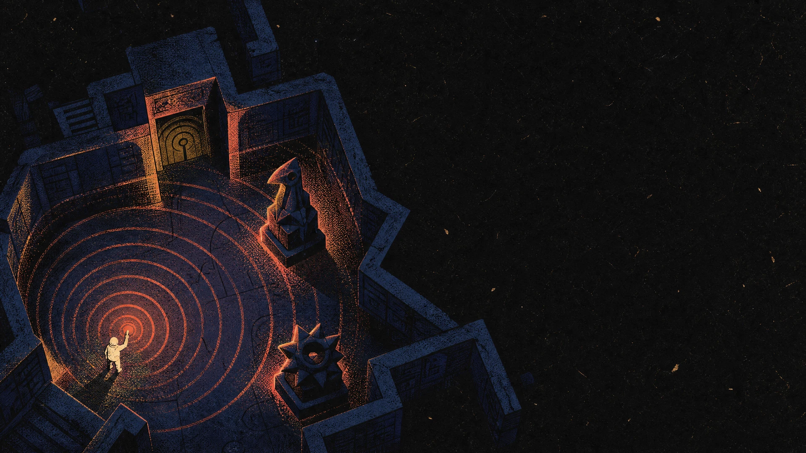

<div align="center">


# SELY.TR — MiniGame Hub

**Her gün değişen bir seçki, istediğin zaman oynayabileceğin 17 mini oyun.**
Bulmaca, çıkarım, refleks ve 3D keşif; hepsi tarayıcıda, hesap açmadan.

[](https://sely.tr)
[](https://github.com/dixtuel/sely-minigame-hub/releases/latest)
[](https://github.com/dixtuel/sely-minigame-hub/actions/workflows/ci.yml)
[](LICENSE)

[Oyuna gir](https://sely.tr) · [Oyunları keşfet](#oyunlar) · [Kendi sunucunda çalıştır](#kurulum) · [Geliştirmeye katıl](#geliştirme-ve-katkı)

</div>

## SELY nedir?

SELY, kısa bir mola için açıp oynayabileceğin oyunları tek bir katalogda toplar. Günün önerisi ve seçili oyunlar değişir; diğer oyunlar arşivden her zaman erişilebilir.

## Öne çıkanlar

- **Günlük seçki, kalıcı katalog:** Yeni bir öneriyle başla veya 17 oyundan istediğine dön.
- **Kendi ritminde ilerleme:** Günlük içerik seed tabanlıdır; rekorun yükseldikçe bazı oyunların zorluğu değişir.
- **Hesapsız oyun:** Kişisel rekorların tarayıcında kalır; günlük liderlik tablosuna skor gönderebilirsin.
- **Ekranına uygun kontrol:** Türkçe/İngilizce arayüz; klavye, fare ve dokunmatik etkileşim.
- **Anahtarsız Vaka:** Dış yapay zekâ anahtarı olmasa da dedektiflik oyunu deterministik yerel motoruyla sürer.

<p align="center">
  <a href="https://sely.tr/play/echo"></a>
  <a href="https://sely.tr/play/vaka"></a>
  <a href="https://sely.tr/play/knot"></a>
</p>

## Oyunlar

| Oyun            | Ne yaparsın?                                            | Süre        |
| --------------- | ------------------------------------------------------- | ----------- |
| **Yankı Odası** | Karanlık labirentte yankı bütçeni koruyarak üç izi bul. | 3–5 dk      |
| **Vaka**        | Şüphelinin ifadesiyle çelişen kanıtı seç.               | 3–5 dk      |
| **Dörtyol**     | Düşen blokları yerleştirip satırları temizle.           | 3–8 dk      |
| **Kıvılcım**    | Kıvılcımı engeller arasında havada tut.                 | Sonsuz uçuş |
| **Düğüm**       | Karoları çevirerek kaynaktan hedefe akış kur.           | 1–3 dk      |
| **Kırpık**      | Hareketli şekilleri tek çizgiyle kes, zincir oluştur.   | 90 sn       |
| **Gölge Payı**  | Gecikmeli gölgeni iki hedefle aynı anda hizala.         | 2 dk        |
| **Hane**        | Sayı veya sözcük kayıtlarında işaretlerden sonuca git.  | 2–4 dk      |
| **Göktaşı**     | Uzay aracını yönlendirip asteroitleri parçala.          | 3–5 dk      |
| **İstif**       | Kutuları köşeye sıkıştırmadan hedeflere taşı.           | 3–6 dk      |
| **İniş**        | İtiş gücünü ve açını ayarlayarak piste in.              | 2–4 dk      |
| **Şebeke**      | Düğümleri değiştirip tüm ışıkları söndür.               | 2–5 dk      |
| **Kare 2048**   | Sayıları kaydırıp birleştirerek 2048'e ulaş.            | 3–10 dk     |
| **Coil**        | Yılanı büyütürken kenardan ve kuyruğundan kaçın.        | 2–5 dk      |
| **Apex**        | Trafikte şerit değiştir, hızını ve serini koru.         | 2–4 dk      |
| **Lift**        | Platformlardan sekerek yukarı çık.                      | 2–5 dk      |
| **Breakline**   | Topu oyunda tutup günlük tuğla dizisini temizle.        | 2–6 dk      |

Oyun adları, açıklamaları ve kontrollerinin kaynağı [`client/src/lib/catalog.ts`](client/src/lib/catalog.ts) dosyasıdır.

## Kurulum

SELY'yi hazır paketle veya kaynak koddan çalıştırabilirsin. Self-host kurulumları varsayılan olarak yerel SQLite kullanır; Redis isteğe bağlıdır.

| Yol                                                              | Gerekenler                          | Başlangıç                                              |
| ---------------------------------------------------------------- | ----------------------------------- | ------------------------------------------------------ |
| [Hazır Docker paketi](docs/DEPLOYMENT.md#hazır-docker-paketi)    | Docker Engine + Compose             | Arşivi aç, `./start.sh` çalıştır.                      |
| [Hazır standalone](docs/DEPLOYMENT.md#hazır-standalone-paketi)   | Linux amd64, glibc 2.34+            | Arşivi aç, `./install.sh` çalıştır.                    |
| [Kaynaktan Docker ile](docs/DEPLOYMENT.md#kaynaktan-kurulum)     | Git + Docker                        | `docker compose up -d --build`                         |
| [Kaynaktan Docker olmadan](docs/DEPLOYMENT.md#kaynaktan-kurulum) | Node.js 22+, pnpm, Rust             | Frontend'i derle, `pnpm start` ile Rust sunucusunu aç. |
| [Vercel](docs/DEPLOYMENT.md#vercel)                              | Vercel hesabı; kalıcılık için Turso | Repoyu Git ile içe aktar ve deploy et.                 |

Hazır Docker ve standalone arşivleri ile `SHA256SUMS` dosyası [son GitHub Release'de](https://github.com/dixtuel/sely-minigame-hub/releases/latest) bulunur. İndirme, checksum, güncelleme ve ortam ayarları için [kurulum rehberini](docs/DEPLOYMENT.md) kullan.

### Kaynaktan hızlı başlangıç

Docker olmadan tam uygulamayı çalıştırmak için Node.js 22+, Corepack/pnpm 10.34.5 ve stable Rust gerekir:

```bash
git clone https://github.com/dixtuel/sely-minigame-hub.git
cd sely-minigame-hub
corepack enable
pnpm install --frozen-lockfile
pnpm run build
pnpm start
```

Uygulama [localhost:3000](http://localhost:3000) adresinde açılır. Yalnız arayüz üzerinde çalışıyorsan `pnpm dev`, Vite sunucusunu [localhost:5173](http://localhost:5173) adresinde başlatır; Rust API'sini başlatmaz. Docker, hazır binary, Vercel ve güncelleme adımları [kurulum rehberinde](docs/DEPLOYMENT.md) ayrıntılıdır.

## Teknik yapı

| Katman       | Kullanılan yapı                                                                            |
| ------------ | ------------------------------------------------------------------------------------------ |
| Arayüz       | React, TypeScript, Vite; oyunlara göre Canvas ve Babylon.js                                |
| Oyun mantığı | İstemci kodu ve bazı oyunlarda paylaşılan Rust/WASM çekirdeği                              |
| API          | Rust, Axum, Tokio; aynı kodun standalone ve Vercel Function girişleri                      |
| Veri         | Self-host için SQLite; Vercel'de kalıcılık için Turso/libSQL; isteğe bağlı Redis önbelleği |

`main` güncel Rust uygulamasıdır. Eski Node.js backend'i [`nodejs-legacy`](https://github.com/dixtuel/sely-minigame-hub/tree/nodejs-legacy) dalında arşivlenmiştir. Desteklenen ortam değişkenleri ve varsayılanları [`.env.example`](.env.example) dosyasındadır.

## Geliştirme ve katkı

Değişiklik göndermeden önce ilgili kontrolleri çalıştır:

```bash
pnpm run check
pnpm test
pnpm run audit:public
pnpm run build
cargo test --locked --all-targets
```

Paylaşılan Rust/WASM oyun çekirdeğini değiştirdiysen `pnpm run build:wasm` ile tarayıcı çıktısını yeniden üret ve değişen dosyaları commit'le. Hata bildirimi veya oyun önerisi için [issue](https://github.com/dixtuel/sely-minigame-hub/issues) açabilirsin; kod değişiklikleri için Pull Request gönder.

## Lisans ve atıflar

Kaynak kodu [AGPL-3.0](LICENSE) lisanslıdır. SELY marka işaretleri ve oyun afişlerinin kullanım koşulları kod lisansından ayrıdır; üçüncü taraf bileşenler ve görseller için [atıf ve lisans notlarına](docs/ATTRIBUTION.md) bak.
