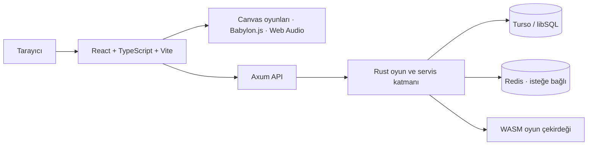

<div align="center">

# SELY.TR MiniGame Hub

**Kısa oturumlar, kendine özgü mekanikler ve her gün değişen bir oyun rotası.**

[](https://sely.tr)
[](LICENSE)
[](https://www.rust-lang.org/)
[](https://vite.dev/)
[](https://github.com/dixtuel/sely-minigame-hub/actions/workflows/ci.yml)

[**Oyna**](https://sely.tr) · [**Oyun kataloğu**](#oyun-kataloğu) · [**Hızlı başlangıç**](#hızlı-başlangıç) · [**Mimari**](#mimari)

</div>

---

## SELY nedir?

SELY.TR, masaüstü ve mobil tarayıcılarda çalışan 17 mini oyundan oluşan açık kaynaklı bir oyun platformudur. Her gün 11 oyunluk rotasyon havuzundan dört oyun öne çıkar; diğer oyunlar Arşiv'de her zaman oynanabilir. Günlük içerik deterministik seed'lerle üretilir; kişisel ustalık seviyesi ise zorluğu oyuncunun performansına göre ayarlar.

Oyunları hesap açmadan oynayabilirsin. Günlük içerik ve skor tablosu API üzerinden sunulur; kişisel ustalık seviyesi oyuncunun yerel yüksek skoruna göre hesaplanır. Üretimde frontend Vercel'in statik dağıtım/CDN katmanında, API ise Rust/Axum serverless function olarak çalışır. Aynı Rust uygulaması standalone binary veya Docker Compose ile kendi sunucunda da çalıştırılabilir.

## Öne çıkanlar

- 17 arcade, bulmaca, strateji ve 3D keşif oyunu.
- Her gün yenilenen, seed tabanlı içerik ve paylaşılan günlük skor tablosu.
- Oyuncu performansına göre kademeli ayarlanan ortak ustalık sistemi.
- Klavye, fare, dokunma, kaydırma ve oyunlara özel mobil kontroller.
- Türkçe ve İngilizce arayüz.
- Canvas ve Web Audio kullanan hafif oyunlar; 3D keşif için Babylon.js.
- Vercel Serverless ve kendi sunucunda Rust/Axum çalıştırma seçenekleri.

## Oyun kataloğu

|   # | Oyun                      | Tür              | Kısa açıklama                                                   |
| --: | ------------------------- | ---------------- | --------------------------------------------------------------- |
|  01 | Yankı Odası / Echo Room   | 3D keşif         | Yankı bütçeni koruyarak karanlık labirentte işaretleri bul.     |
|  02 | Vaka / Case               | Dedektiflik      | Şüpheliyi ifadesiyle çelişen kanıtla köşeye sıkıştır.           |
|  03 | Dörtyol / Tetris          | Arcade           | Blokları yerleştir, satırları temizle ve hızlanan oyuna dayan.  |
|  04 | Kıvılcım / Spark          | Arcade           | Kıvılcımı trafikten ve yol tehlikelerinden geçir.               |
|  05 | Düğüm / Knot              | Akış bulmacası   | Karoları çevirerek kaynaktan hedefe kesintisiz bir akış kur.    |
|  06 | Kırpık / Cutout           | Geometri         | Hareketli şekilleri tek çizgiyle ve sınırlı enerjiyle kes.      |
|  07 | Gölge Payı / Shadow Share | Zamanlama        | Gecikmeli gölgenle eşzamanlanıp çıkışa ulaş.                    |
|  08 | Hane / Hane               | Çıkarım          | Sayı veya kelime kayıtlarındaki ipuçlarını kullan.              |
|  09 | Göktaşı / Asteroids       | Uzay aksiyonu    | Gemiyi yönlendir, asteroitleri ve uzaylıları savuştur.          |
|  10 | İstif / Sokoban           | Mantık           | Kutuları hedeflere it; her hamleyi önceden planla.              |
|  11 | İniş / Lander             | Fizik            | İtiş ve eğimi ayarlayarak piste güvenle in.                     |
|  12 | Şebeke / Lights Out       | Mantık bulmacası | Bir düğmeye basıp komşularını da değiştir; şebekeyi söndür.     |
|  13 | Kare 2048 / 2048          | Sayı bulmacası   | Sayıları kaydırıp birleştirerek 2048'e ulaş.                    |
|  14 | Coil                      | Grid arcade      | Büyürken kendi izine ve duvara çarpmadan rotanı çiz.            |
|  15 | Apex                      | Yarış            | Dört şeritli trafikte hızını ayarla, yakın geçişlerle seri kur. |
|  16 | Lift                      | Dikey platform   | Hareketli, kırılgan ve yaylı platformlarla yüksel.              |
|  17 | Breakline                 | Tuğla kırma      | Topu oyunda tutup her gün değişen tuğla dizisini temizle.       |

Oyun adları, kontrolleri ve yerelleştirilmiş açıklamalar `client/src/lib/catalog.ts` dosyasındaki tek katalogdan yönetilir.

## Hızlı başlangıç

### Gereksinimler

- Node.js 22 veya üzeri ve pnpm 10
- Stable Rust toolchain (standalone backend veya Rust kodunu değiştirmek için)
- Docker Compose (isteğe bağlı)

İstemciyi geliştirme modunda açmak için:

```bash
git clone https://github.com/dixtuel/sely-minigame-hub.git
cd sely-minigame-hub
pnpm install
pnpm dev
```

Vite istemciyi `http://localhost:5173` üzerinde sunar. Backend API'lerini de içeren yerel çalışma için üretim bundle'ını oluşturup standalone sunucuyu başlat:

```bash
pnpm build
pnpm start
```

Standalone sunucu varsayılan olarak `http://localhost:3000` adresinde çalışır. Portu `PORT` değişkeniyle değiştirebilirsin. Yerel ve dağıtım ayarları için [`.env.example`](.env.example) dosyasına bak; çoğu yerel oyun akışı ek bir gizli anahtar gerektirmez.

## Dağıtım

### Vercel

Repo, statik Vite istemcisi ve `api/index.rs` Rust/Axum function'ı için yapılandırılmıştır. `vercel.json`, günlük içerik üretimi ve eski kayıtların temizliği için zamanlanmış endpoint'leri de tanımlar. Kendi Vercel projen için:

[](https://vercel.com/new/clone?repository-url=https%3A%2F%2Fgithub.com%2Fdixtuel%2Fsely-minigame-hub)

Gerekli ortam değişkenlerini Vercel proje ayarlarından tanımla; isimler ve açıklamalar [`.env.example`](.env.example) içinde tutulur. Vercel dağıtımı bu README'deki yerel geliştirme komutlarından ayrıdır.

### Standalone Rust

```bash
pnpm install
pnpm build
pnpm start
```

`pnpm start`, release modunda Axum sunucusunu başlatır; sunucu derlenmiş frontend'i ve API route'larını aynı origin üzerinden servis eder. Bir VDS/VPS üzerinde systemd ve Caddy/Nginx reverse proxy arkasında çalıştırılabilir.

### Docker Compose

```bash
docker compose -f docker/docker-compose.yml up --build -d
```

Compose kurulumu Rust uygulamasını ve Redis'i başlatır. Yerel kalıcı veriler Docker volume'larında saklanır. Compose ve environment ayarlarının ayrıntısı [`docker/`](docker/) ve [`.env.example`](.env.example) içindedir.

## Komutlar

| Komut                                      | Ne yapar?                                                   |
| ------------------------------------------ | ----------------------------------------------------------- |
| `pnpm dev`                                 | Vite istemci geliştirme sunucusunu açar.                    |
| `pnpm run check`                           | TypeScript tip kontrolü.                                    |
| `pnpm test`                                | Vitest testleri.                                            |
| `pnpm run audit:public`                    | Public release dosyalarında sızıntı denetimi.               |
| `pnpm run build`                           | Vite üretim istemcisini `dist/public` içine derler.         |
| `pnpm start`                               | Rust/Axum standalone sunucusunu release modunda çalıştırır. |
| `pnpm run dev:rust`                        | Rust/Axum standalone sunucusunu debug modunda çalıştırır.   |
| `cargo check --bin standalone --bin index` | Standalone ve Vercel Rust girişlerini kontrol eder.         |
| `cargo test --lib`                         | Rust backend kütüphane testleri.                            |
| `pnpm run build:wasm`                      | Oyun çekirdeğini WASM'a derler.                             |

Pull request öncesi önerilen kontroller:

```bash
pnpm run check
pnpm test
pnpm run audit:public
pnpm run build
cargo check --bin standalone --bin index
cargo test --lib
```

## Mimari



`main` dalı güncel Rust/Axum uygulamasıdır. Önceki Node.js/Express/tRPC sürümü yalnız tarihsel referans olarak [`nodejs-legacy`](https://github.com/dixtuel/sely-minigame-hub/tree/nodejs-legacy) dalında tutulur.

| Yol                      | İçerik                                                                    |
| ------------------------ | ------------------------------------------------------------------------- |
| `client/`                | React arayüzü, oyun bileşenleri, Canvas render ve istemci generator'ları. |
| `src/`                   | Axum route'ları, servisler, storage ve Rust oyun mantığı.                 |
| `crates/sely-game-core/` | WebAssembly olarak da derlenen ortak Rust oyun çekirdeği.                 |
| `api/`                   | Vercel Rust function girişi.                                              |
| `shared/`                | İstemci ve sunucuda kullanılan ortak tip/veriler.                         |
| `docker/`                | Self-host Dockerfile ve Compose tanımı.                                   |
| `docs/ATTRIBUTION.md`    | Üründe kullanılan dış kaynak ve lisans atıfları.                          |

## Katkı

Bug, erişilebilirlik sorunu veya oyun fikri için [issue açabilir](https://github.com/dixtuel/sely-minigame-hub/issues); değişikliklerini pull request olarak gönderebilirsin. Yeni oyun eklerken katalog metinleri, Türkçe/İngilizce kontroller, responsive girişler, seed/generator davranışı ve ilgili testleri birlikte güncelle.

## Lisans ve atıflar

Kaynak kodu [GNU Affero General Public License v3.0](LICENSE) altında lisanslanmıştır. Üründe kullanılan üçüncü taraf kaynaklar ve lisans bilgileri [`docs/ATTRIBUTION.md`](docs/ATTRIBUTION.md) içinde tutulur. `SELY.TR` markası ve özgün marka varlıkları kaynak kodu lisansından ayrı değerlendirilir.
