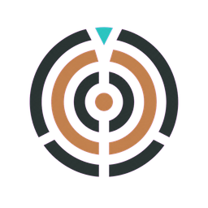
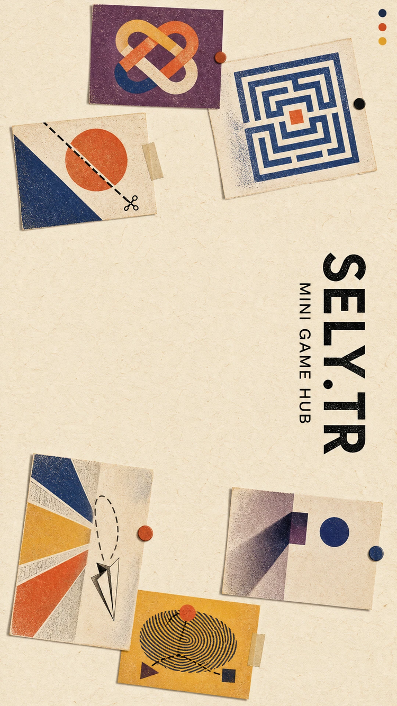

# SELY.TR MiniGame Hub

<p align="center">
  
</p>

**Tarayıcıda kısa oturumlar için tasarlanmış 17 mini oyun; masaüstü ve mobil kontrollerle, Türkçe ve İngilizce.**

[Oyunları oyna](https://sely.tr) · [Dağıtım rehberi](docs/DEPLOYMENT.md) · [Elle release hazırlama](docs/RELEASING.md) · [Atıflar](docs/ATTRIBUTION.md)

[](https://github.com/dixtuel/sely-minigame-hub/actions/workflows/ci.yml)
[](LICENSE)

<p align="center">
  
  
</p>

## SELY nedir?

SELY; arcade, bulmaca, strateji ve 3D keşif deneyimlerini tek bir web uygulamasında bir araya getirir. Günlük seed sistemi öne çıkan oyunları ve içerikleri belirler; katalogdaki diğer oyunlar arşivden erişilebilir. Oyunlar hesap açmadan oynanabilir.

Kontroller oyuna göre klavye, fare, dokunma, kaydırma veya sürükleme kullanır. Ortak skor tablosu ve ustalık akışı oyun oturumları arasında çalışır; arayüz Türkçe ve İngilizce kullanılabilir.

### Öne çıkan özellikler

- **Günlük oyun seçkisi:** Her gün dört oyun günlük katalogda öne çıkar; diğer oyunlar arşivden açılabilir.
- **Yeni oyun oturumları:** Seed kullanan oyunlarda içerik oyun ve oturuma göre değişir; generator testleri üretilen düzenlerin geçerliliğini ve oynanabilirliğini denetler.
- **Masaüstü ve dokunmatik kullanım:** Klavye/fare yanında oyuna uygun dokunma, kaydırma, sürükleme ve sanal kontroller bulunur. Oyun içindeki bilgi düğmesi kontrolleri gösterir.
- **Skor ve ustalık:** Kişisel ilerleme oyun kartlarında görünür; günlük ve genel skor tabloları oturumlarla bütünleşir.
- **İki dil:** Türkçe ve İngilizce katalog ve arayüz.

## Oyun koleksiyonu

| Oyun                      | Oynanış                                              |
| ------------------------- | ---------------------------------------------------- |
| Yankı Odası (Echo Room)   | 3D labirentte yankılarla izleri bul.                 |
| Vaka (Case)               | İfadeleri kanıtlarla karşılaştırıp vakayı çöz.       |
| Dörtyol (Tetris)          | Blokları yerleştir ve satırları temizle.             |
| Kıvılcım (Spark)          | Kıvılcımı havada tutup arkların arasından geç.       |
| Düğüm (Knot)              | Karoları çevirip kaynaktan hedefe akış kur.          |
| Kırpık (Cutout)           | Hareketli şekilleri tek çizgiyle kes.                |
| Gölge Payı (Shadow Share) | Gecikmeli gölgeni doğru zaman ve konuma eşle.        |
| Hane                      | Sayı veya kelime kaydındaki ipuçlarını çıkar.        |
| Göktaşı (Asteroids)       | Uzay gemini yönlendirip asteroitleri savuştur.       |
| İstif (Sokoban)           | Kutuları iterek hedeflere ulaştır.                   |
| İniş (Lander)             | İtki ve eğimi ayarlayıp piste güvenle in.            |
| Şebeke (Lights Out)       | Bir hücreyi değiştirip komşularıyla şebekeyi söndür. |
| Kare 2048                 | Sayıları kaydırıp birleştirerek 2048'e ulaş.         |
| Coil                      | Yılanı büyütürken duvardan ve kuyruğundan kaç.       |
| Apex                      | Otoyol trafiğinde hızını ayarla ve yakın geçiş yap.  |
| Lift                      | Hareketli platformlardan düşmeden yüksel.            |
| Breakline                 | Topu oyunda tutup tuğla dizisini kır.                |

Oyun adları, türleri ve yerelleştirilmiş açıklamalar için tek kaynak [oyun kataloğudur](client/src/lib/catalog.ts).

## Hızlı başlangıç

Gereksinimler: Node.js 22+ ve pnpm 10. Tam Rust backend'i çalıştırmak için stable Rust gerekir.

Ön yüz geliştirme sunucusu:

```bash
git clone https://github.com/dixtuel/sely-minigame-hub.git
cd sely-minigame-hub
pnpm install --frozen-lockfile
pnpm dev
```

Vite, arayüzü `http://localhost:5173` adresinde sunar; bu mod tek başına Rust API'sini başlatmaz.

Arayüzü ve API'yi aynı origin'de sunan standalone uygulama:

```bash
pnpm run build
pnpm start
```

Sunucu varsayılan olarak `http://localhost:3000` adresinde açılır. Yerel veri `data/sely.db` SQLite dosyasında tutulur. Docker, Vercel veya Linux servis kurulumuna geçmek için [dağıtım rehberine](docs/DEPLOYMENT.md) bak.

## Nasıl çalışır?

| Katman                  | Görev                                                                                               |
| ----------------------- | --------------------------------------------------------------------------------------------------- |
| Web istemcisi           | React 19, TypeScript ve Vite 7; Canvas, Web Audio ve Babylon.js tabanlı oyunlar.                    |
| Paylaşılan oyun mantığı | Rust `crates/sely-game-core` crate'i; bazı algoritmalar WASM olarak tarayıcıda çalışır.             |
| Backend                 | Rust, Axum ve Tokio; Vercel function veya standalone binary olarak çalışabilir.                     |
| Depolama                | Kalıcı SQL için Turso/libSQL veya standalone'da SQLite; Redis isteğe bağlı leaderboard hız katmanı. |

## Dağıtım seçenekleri

| Yöntem         | Uygun olduğu durum                                       | Başlangıç                                                      |
| -------------- | -------------------------------------------------------- | -------------------------------------------------------------- |
| Vercel         | Statik istemci ve Rust serverless API                    | [Vercel rehberi](docs/DEPLOYMENT.md#vercel)                    |
| Docker Compose | Tek komutla self-host; yerel SQLite ve Redis volume'ları | [Docker rehberi](docs/DEPLOYMENT.md#docker-compose)            |
| Standalone     | Binary'yi doğrudan veya systemd service ile çalıştırma   | [Standalone rehberi](docs/DEPLOYMENT.md#standalone-ve-systemd) |

## Yapılandırma ve kalıcılık

Örnek ve açıklamalı değişkenler [`.env.example`](.env.example) dosyasındadır. Değerlerin çoğu isteğe bağlıdır.

- Yerel standalone ve Docker varsayılanları SQLite kullanır; Vercel'de kalıcı skorlar için uzak Turso/libSQL bağlantısı gerekir.
- Redis isteğe bağlıdır; kalıcı skor deposu değildir. PostgreSQL şu an Rust backend'inde desteklenmez.
- Vaka için dış LLM anahtarları isteğe bağlıdır; anahtarsız veya servis hatasında yerel oyun motoru kullanılabilir.
- Site üzerindeki isim ve e-posta `client/src/lib/contact.ts` içindeki düz metin sabitlerden düzenlenir. Bu değerler public build'e girer ve `pnpm run audit:public` ile denetlenir.

## Geliştirme kontrolleri

```bash
pnpm run check
pnpm test
pnpm run build
pnpm run audit:public
cargo check --bin standalone --bin index
cargo test --lib
```

`crates/sely-game-core` değiştirildiğinde takip edilen tarayıcı çıktısını `pnpm run build:wasm` ile yeniden üret ve değişikliği de birlikte test et.

## Repo haritası

- `client/` — arayüz, oyun bileşenleri ve istemci level generator'ları.
- `src/` — Rust/Axum route'ları, servisler, storage ve oyun mantığı.
- `crates/sely-game-core/` — paylaşılan Rust/WASM çekirdeği.
- `api/` — Vercel Rust function girişi.
- `docker/` ve `systemd/` — self-host örnekleri.
- `docs/DEPLOYMENT.md` ve `docs/ATTRIBUTION.md` — kurulum ve dış kaynak atıfları.

`main` güncel Rust backend'idir. Önceki Node.js backend'i `nodejs-legacy` dalında arşivlenmiştir.

## Belgeler

| Belge                                              | İçerik                                                                                   |
| -------------------------------------------------- | ---------------------------------------------------------------------------------------- |
| [Dağıtım ve self-host rehberi](docs/DEPLOYMENT.md) | Vercel, Docker Compose, standalone binary, systemd, kalıcılık ve sorun giderme.          |
| [Elle release hazırlama](docs/RELEASING.md)        | Vercel kaynak arşivi, Docker image/Compose ve standalone Linux paketlerini üretme/kurma. |
| [Atıflar](docs/ATTRIBUTION.md)                     | Kaynak kodu ve asset lisansları/atıfları.                                                |
| [Güvenlik politikası](SECURITY.md)                 | Güvenlik açığı bildirim yolu.                                                            |
| [Ortam değişkenleri](.env.example)                 | İsteğe bağlı backend ve frontend yapılandırmaları.                                       |

## Katkı ve lisans

Hata veya geliştirme önerileri için [GitHub Issues](https://github.com/dixtuel/sely-minigame-hub/issues) açabilirsin. Yeni oyun eklerken katalog/çevirileri, kontrolleri, responsive girişleri, seed/generator davranışını ve ilgili testleri birlikte güncelle.

Kaynak kodu [AGPL-3.0](LICENSE) lisanslıdır. Oyunda kullanılan üçüncü taraf kod ve asset atıfları [ATTRIBUTION.md](docs/ATTRIBUTION.md) dosyasındadır. SELY adı ve özgün marka varlıkları kaynak kodu lisansından ayrı değerlendirilir.
