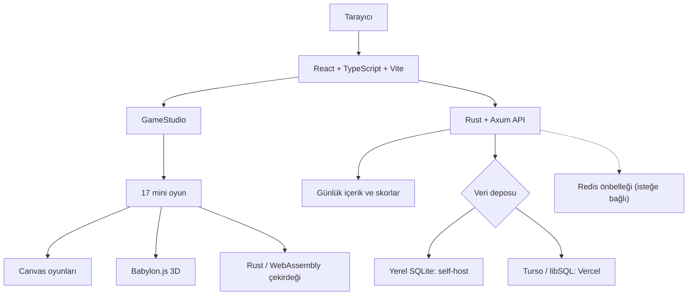

<div align="center">

# SELY.TR — MiniGame Hub

**Tarayıcıda oynanan 17 kısa oyun. Her gün değişen dört öne çıkan oyun. Hesap açmadan, doğrudan oyuna.**

[](https://sely.tr)
[](https://github.com/dixtuel/sely-minigame-hub/releases/latest)
[](https://github.com/dixtuel/sely-minigame-hub/actions/workflows/ci.yml)
[](LICENSE)
[](docs/DEPLOYMENT.md)
[](https://www.typescriptlang.org/)
[](https://vitest.dev/)

[**Canlı demoyu aç**](https://sely.tr) · [**Oyun kataloğuna git**](#oyun-kataloğu) · [**Yerel çalıştır**](#hızlı-başlangıç)

</div>

---

## SELY nedir?

SELY.TR, birkaç dakikada oynanabilen mini oyunları tek bir yerde toplayan bir web oyun platformu. Ana sayfada her gün dört farklı oyun öne çıkar; katalogdaki 17 oyunun tamamı her zaman oynanabilir. Bulmaca çözebilir, reflekslerini deneyebilir, karanlık bir labirente girebilir veya bir vakada çelişen kanıtı bulabilirsin.

Günlük içerik seed tabanlı üretilir. Aynı günün temel oyunu tekrar oynanabilir; bazı oyunlarda kişisel ustalık arttıkça zorluk da değişir. Hesap açmak gerekmez. Kişisel ilerleme tarayıcıda tutulur; günlük skor paylaşımı isteyenler için liderlik tablosu vardır.

Proje, oyuncuya hızlı bir oyun alanı sunarken geliştiriciye de React, TypeScript, Canvas, Babylon.js, Rust ve WebAssembly'nin aynı uygulamada nasıl çalıştığını gösterir.

## Öne çıkan özellikler

- **17 farklı oyun:** Keşif, dedektiflik, akış ve sayı bulmacaları, fizik, klasik arcade ve refleks oyunları.
- **Her gün yeni bir başlangıç:** Günlük içerik paketi dört oyunu öne çıkarır; kalan oyunlar katalogda durur.
- **Tekrarlanabilir seviyeler:** Günlük seed ve oyun kuralları aynı girdiden aynı içeriği üretir.
- **Ustalık ve çözüm kontrolü:** Bazı oyunların zorluğu performansa göre ilerler; Düğüm, Kırpık ve Gölge Payı gibi oyunlarda üretilen seviyeler çözülebilirlik kontrolünden geçer.
- **Masaüstü ve mobil:** Oyuna göre klavye, fare, dokunmatik ekran veya sanal kontrol kullanılır.
- **Türkçe ve İngilizce:** Türkçe ana rota ile `/en` rotası aynı kataloğu sunar.
- **Hesapsız kullanım:** Yerel ilerleme tarayıcıda kalır; skor gönderimi isteğe bağlıdır.
- **Esnek çalıştırma:** Vercel'de, Docker ile veya bağımsız Rust sunucusu olarak çalışır. Vaka oyunu dış yapay zekâ anahtarı olmadan da yerel motoruyla devam eder.

## Oyun kataloğu

| Oyun | Tür | Temel fikir | Yaklaşık süre |
| --- | --- | --- | --- |
| **Yankı Odası** | 3D keşif | Karanlık labirentte yankı bütçeni koruyarak üç izi bul. | 3–5 dk |
| **Vaka** | Dedektiflik | Şüphelinin ifadesiyle çelişen kanıtı sun. | 3–5 dk |
| **Dörtyol** | Blok / hız | Düşen bloklarla satırları tamamla ve temizle. | 3–8 dk |
| **Kıvılcım** | Arcade uçuş | Kıvılcımı engellerin arasında havada tut. | Sonsuz uçuş |
| **Düğüm** | Akış bulmacası | Karoları çevirip kaynağı hedefe bağla. | 1–3 dk |
| **Kırpık** | Geometri / ritim | Hareketli şekilleri tek çizgiyle kes. | 90 sn |
| **Gölge Payı** | Zamanlama | Gecikmeli gölgeni iki hedefle hizala. | 2 dk |
| **Hane** | Sayı / sözcük mantığı | Kayıtlardaki işaretlerden sonuca git. | 2–4 dk |
| **Göktaşı** | Uzay arcade | Asteroitleri parçala ve gemini koru. | 3–5 dk |
| **İstif** | Kutu bulmacası | Kutuları köşeye sıkıştırmadan hedeflere taşı. | 3–6 dk |
| **İniş** | Fizik | İtiş gücünü ayarlayıp piste güvenle in. | 2–4 dk |
| **Şebeke** | Mantık | Düğümleri değiştirip tüm ışıkları söndür. | 2–5 dk |
| **Kare 2048** | Sayı bulmacası | Sayıları kaydırarak 2048'e ulaş. | 3–10 dk |
| **Coil** | Yılan oyunu | Büyürken kenardan ve kuyruğundan kaçın. | 2–5 dk |
| **Apex** | Yarış | Trafikte şerit değiştirip serini koru. | 2–4 dk |
| **Lift** | Platform | Platformlardan sekerek yukarı çık. | 2–5 dk |
| **Breakline** | Tuğla kırma | Topu oyunda tutup günlük diziyi temizle. | 2–6 dk |

Oyun adları, kontroller ve süreler [oyun kataloğunda](client/src/lib/catalog.ts) tanımlanır.

## Tasarım ve teknik yaklaşım

### Günlük oyunlar ve ustalık

Rust sunucusu tarih ve oyun kimliğinden günlük seed üretir. Günlük paketteki oyunlardan dördü ana sayfada öne çıkar; bu seçim istemcide ayrı bir kuralla yeniden hesaplanmaz. Oyuncu bir oyuna tekrar döndüğünde aynı günlük temelden başlayabilir. Ustalık seviyesi, destekleyen oyunların parametrelerini değiştirir; örneğin daha yoğun bir düzen veya daha dar bir hata payı oluşturur.

### Çözülebilirlik kontrolü

Bazı prosedürel oyunlar, aday seviyeyi göstermeden önce oyuna uygun kontroller uygular. Her oyunun üretim yöntemi farklıdır.

| Oyun | Üretim | Kontrol |
| --- | --- | --- |
| Düğüm | Bağlantılı karo ağı | Kaynak ile hedef arasında geçerli akış aranır. |
| Kırpık | Hareketli şekiller ve kesim hedefi | Hedefin mevcut kesim hakkıyla tamamlanabilirliği denetlenir. |
| Gölge Payı | Gecikmeli hareket ve hedef yerleşimi | Oyuncu ile gölgenin hedeflere ulaşabileceği durumlar sınanır. |

Bu oyunların ortak mantığının bir bölümü [Rust oyun çekirdeğinde](crates/sely-game-core) tutulur ve WebAssembly ile tarayıcıda da çalışır.

## Hızlı başlangıç

Kaynak koddan Docker olmadan çalıştırmak için Node.js 22+, Corepack/pnpm 10.34.5 ve stable Rust gerekir:

```bash
git clone https://github.com/dixtuel/sely-minigame-hub.git
cd sely-minigame-hub
corepack enable
pnpm install --frozen-lockfile
pnpm run build
pnpm start
```

Tam uygulama [localhost:3000](http://localhost:3000) adresinde açılır. `pnpm dev` yalnız Vite arayüzünü [localhost:5173](http://localhost:5173) üzerinde başlatır; Rust API'sini başlatmaz. İlk yerel çalıştırmada harici veritabanı veya Redis zorunlu değildir. Diğer kurulum yolları [aşağıda](#dağıtım-seçenekleri) özetlenmiştir.

## Geliştirme komutları

| Komut | Açıklama |
| --- | --- |
| `pnpm dev` | Vite arayüzünü geliştirme modunda açar. |
| `pnpm run check` | TypeScript tip kontrolünü çalıştırır. |
| `pnpm test` | Vitest testlerini çalıştırır. |
| `pnpm run audit:public` | Public release'e girecek dosyaları denetler. |
| `pnpm run build` | Vite arayüzünü üretim için derler. |
| `pnpm start` | Rust standalone sunucusunu release modunda derleyip başlatır. |
| `cargo test --locked --all-targets` | Rust testlerini çalıştırır. |

Paylaşılan oyun çekirdeğini değiştirirsen `pnpm run build:wasm` ile tarayıcı çıktısını yeniden üret ve değişen dosyaları commit'le.

## Dağıtım seçenekleri

SELY'yi kendi sunucunda hazır paketle veya kaynaktan çalıştırabilir, istersen Vercel'e kurabilirsin:

| Yol | Gerekenler | Başlangıç |
| --- | --- | --- |
| [Hazır Docker paketi](docs/DEPLOYMENT.md#hazır-docker-paketi) | Docker Engine + Compose | Release arşivini aç, `./start.sh` çalıştır. |
| [Hazır standalone paketi](docs/DEPLOYMENT.md#hazır-standalone-paketi) | Linux amd64, glibc 2.34+ | Release arşivini aç, `./install.sh` çalıştır. |
| [Kaynaktan Docker](docs/DEPLOYMENT.md#kaynaktan-kurulum) | Git + Docker | `docker compose up -d --build` |
| [Kaynaktan Docker olmadan](docs/DEPLOYMENT.md#kaynaktan-kurulum) | Node.js, pnpm, Rust | [Hızlı başlangıç](#hızlı-başlangıç) adımlarını izle. |
| [Vercel](docs/DEPLOYMENT.md#vercel) | Vercel hesabı; kalıcılık için Turso | Repoyu içe aktar ve ortam değişkenlerini ayarla. |

Hazır paketler ve `SHA256SUMS` dosyası [son GitHub Release'de](https://github.com/dixtuel/sely-minigame-hub/releases/latest) bulunur. İndirme, doğrulama, güncelleme ve systemd adımları [kurulum rehberinde](docs/DEPLOYMENT.md) yer alır. Self-host kurulumları varsayılan olarak yerel SQLite kullanır; Redis isteğe bağlıdır. Vercel'de kalıcı veri için Turso/libSQL ayarlanmalıdır.

[](https://vercel.com/new/clone?repository-url=https%3A%2F%2Fgithub.com%2Fdixtuel%2Fsely-minigame-hub)

## Ortam değişkenleri

Tam liste ve örnek değerler [`.env.example`](.env.example) dosyasında bulunur. Temel ayarlar:

| Alan | Değişken | Ne zaman gerekir? |
| --- | --- | --- |
| Kalıcı veri | `TURSO_DATABASE_URL`, `TURSO_AUTH_TOKEN` | Vercel'de kalıcı skorlar ve günlük içerik için. |
| Önbellek | `REDIS_URL` | Redis kullanmak istersen. |
| Günlük işler | `CRON_SECRET` veya `DAILY_JOB_TOKEN` | Vercel Cron veya self-host zamanlayıcısı için. |
| Vaka yapay zekâsı | Sağlayıcı anahtarları | Dış model kullanmak istersen; yerel motor anahtarsız çalışır. |

Bu Rust backend'i PostgreSQL `DATABASE_URL` bağlantısını desteklemez.

## Mimari genel görünüm



API, Vercel'de Rust Function; Docker ve standalone kurulumlarında aynı Rust uygulamasının sunucu binary'si olarak çalışır. Oyun sonucu paylaşım kartları için [ayrı bir Edge endpoint'i](api/og.ts) kullanılır.

### Dizin yapısı

```text
client/           React arayüzü, oyun bileşenleri ve statik dosyalar
src/              Rust API, oyun mantığı ve veri katmanı
crates/           Tarayıcıyla paylaşılan Rust/WebAssembly oyun çekirdeği
api/              Vercel Rust Function ve paylaşım kartı girişleri
server/og/        Paylaşım kartı şablonu
scripts/          Build, paketleme ve public release kontrolleri
docs/             Kurulum, güvenlik ve atıf belgeleri
```

`main` güncel Rust sürümüdür. Eski Node.js backend'i [`nodejs-legacy`](https://github.com/dixtuel/sely-minigame-hub/tree/nodejs-legacy) dalında arşivlenmiştir.

## Veri ve gizlilik

Oynamak için hesap, parola veya e-posta gerekmez. Kişisel oyun durumu ve dil tercihi tarayıcıda saklanır. Skor gönderildiğinde liderlik tablosu, kurulu veri deposunu kullanır. Analytics, Speed Insights ve reklam entegrasyonları ilgili ortam ayarlarıyla etkinleştirilir; ayrıntılar [`.env.example`](.env.example) ve [gizlilik bildiriminde](https://sely.tr/privacy) bulunur.

## Katkıda bulunma

Hata veya oyun önerisi için [issue](https://github.com/dixtuel/sely-minigame-hub/issues) açabilirsin. Kod değişikliği göndereceksen ilgili TypeScript ve Rust kontrollerini çalıştır, oyun davranışı veya veri sözleşmesi değiştiyse bunu Pull Request'te açıkla. Yeni bir oyun eklerken katalog kaydını, İngilizce metinleri, kontrolleri ve gerekiyorsa çözüm testlerini birlikte güncelle.

## Atıflar

Kullanılan açık kaynak bileşenler ve üçüncü taraf görseller [atıf notlarında](docs/ATTRIBUTION.md) listelenir.

## Lisans ve marka

Kaynak kodu [AGPL-3.0](LICENSE) lisanslıdır. SELY adı, logosu ve oyun görselleri için ayrı kullanım koşulları geçerlidir.
