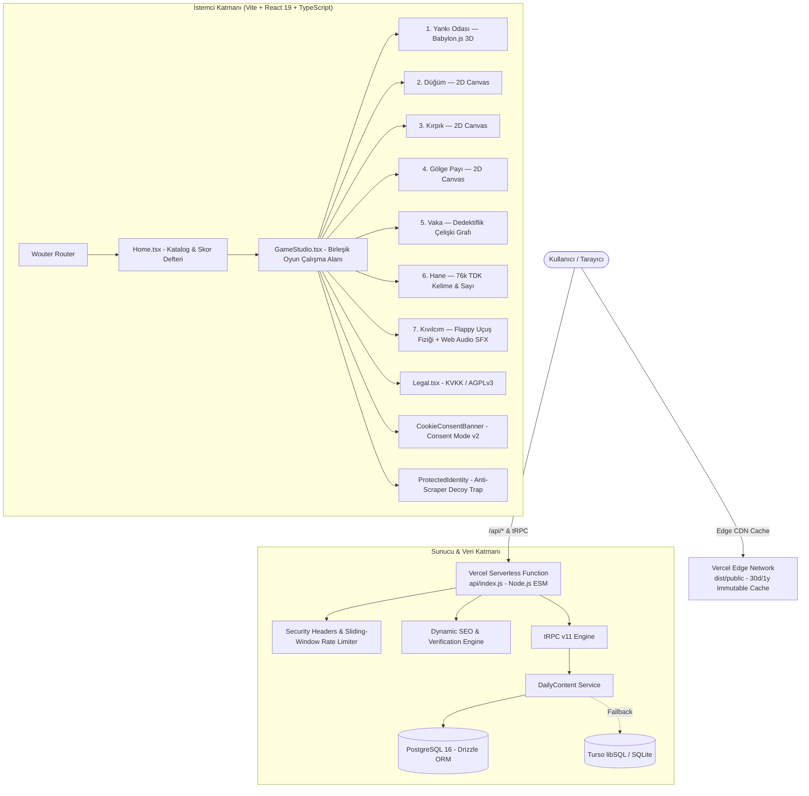

<div align="center">

# SELY.TR — MiniGame Hub

**Günlük prosedürel 7 mini oyun platformu: tek ustalık ve skor sistemi, risograph editoryal görsel dili, sıfır takip çerezi.**

[](https://sely.tr)
[](LICENSE)
[](https://sely.tr)
[](https://www.babylonjs.com/)
[](https://vitest.dev/)
[](https://www.typescriptlang.org/)

Her sabah her oyun için yeni bir "günün seti" deterministik olarak üretilir. Oyuncunun ustalık puanı (mastery) arttıkça turlar daha karmaşık hale gelir; ancak üretilen her bulmaca ve labirent matematiksel çözücüler (BFS, Dijkstra, Spanning Tree) tarafından üretim anında **kesinlikle çözülebilir** olduğu doğrulanarak sunulur.

[Canlı Demo](https://sely.tr) • [Oyunlar](#oyunlar-ve-motor-mimarisi) • [Sistem Mimarisi](#sistem-mimarisi) • [Teknoloji Yığını](#teknoloji-yığını) • [Güvenlik ve Gizlilik](#güvenlik-ve-gizlilik) • [Yerel Geliştirme](#yerel-geliştirme) • [Dağıtım](#dağıtım-vercel) • [Atıflar](#açık-kaynak-atıfları)

</div>

---

## Oyunlar ve Motor Mimarisi

Görsel dil; editoryal poster tipografisi, kâğıt yüzey dokuları ve baskı atölyesi ritminden oluşur. Yedi oyun birbirinden bağımsız çalışır; ortak olan yalnız günlük tohum (seed), ustalık (mastery) ve tarayıcı-yerel skor defteridir.

| Oyun | Tür / Motor | Matematiksel Algoritma & Mekanik | Doğrulama & Çözücü |
| :--- | :--- | :--- | :--- |
| **Yankı Odası** | 3D Keşif<br/>`@babylonjs/core` | Recursive-Backtracker ile 34×30m labirent üretimi, dinamik braiding (döngü/alternatif yol oranı), sis perdesi (fog-of-war) ve eksen-ayrık duvar çarpışması. | **Dijkstra En-Az-Gürültü:** 0-hatalı ideal rotanın ses maliyetini hesaplar (`echoMinimalNoise`); tolerans payı rotaya göre dinamik eklenir. |
| **Düğüm** | 2D Bulmaca<br/>HTML5 Canvas | Randomized DFS Spanning Tree üzerinden yönlendirilmiş akış rotası; karolar tıklanarak döndürülür ve kaynak hedefe bağlanır. | **BFS Çözülebilirlik Denetimi:** Her seviye üretildikten sonra `isKnotLevelSolvable` BFS algoritması ile taranır (900/900 tohumda %100 çözülebilir). |
| **Kırpık** | 2D Geometri<br/>HTML5 Canvas | Rejection-sampling ile çokgen ve hareketli kâğıt katmanları; sınırlı kesim enerjisiyle alan bölme. | **Alan Doğrulayıcı:** Kesim çizgilerinin poligonu geçerli parçalara ayırdığı ve hedefin ulaşılabilir olduğu doğrulanır. |
| **Gölge Payı** | 2D Zaman/Refleks<br/>HTML5 Canvas | Oyuncunun hareket vektörlerini geçmiş tamponunda saklayan ve gecikmeli simüle eden gölge matrisi; çift hedefli eşzamanlı eşleme. | **Solver Simülasyonu:** 60 seed × 3 mastery üzerinde hedeflerin eşzamanlı kilitlenebilirliği doğrulanır. |
| **Vaka** | Dedektiflik / Mantık<br/>State Machine | World Model + Truth Model + Evidence Graph. Dedektif önce şüpheliyi suçlar, ardından ifadesiyle çelişen kanıtı sunar (`VakaBoard.tsx`). | **Evidence Graph Solver:** `solveVakaCase` bağımsız çözücüsü, ipuçları kümesinden suçlunun tekil ve kesin olarak çıkarılabildiğini kanıtlar. |
| **Hane** | Kelime / Sayı Bulmacası<br/>Metin / Mantık | Sayı modu ve 76.187 kelimelik TDK Türkçe sözlük modu (`ncarkaci/TDKDictionaryCrawler`); her satırda yeşil (tam konum) ve sarı (var ama yanlış yerde) geri bildirimi. | **Kelime Doğrulayıcı:** Günün kelimesi küratörlü havuzdan seçilirken, oyuncunun tahminleri 76 bin kelimelik tam TDK sözlüğünde denetlenir. |
| **Kıvılcım** | Arcade Uçuş Motoru<br/>2D Canvas + Web Audio | Delta-time bağımsız yerçekimi ve darbe fiziği (`sparkPhysicsStep`), pilonlar arası dikey açıklık kısıtı (`maxDelta = 140` clamp), daire-AABB hibrit toleranslı çarpışma kontrolü. | **Fizik Adımı Testleri:** Saf Web Audio API sentezleyici ses efektleri (`sine`, `sawtooth`, `triangle`) ve mobil/PC duyarlı girdi denetimi (`SparkCanvasGame.test.ts`). |

---

## Sistem Mimarisi



---

## Teknoloji Yığını

| Katman | Bileşen / Paket | Sorumluluk ve Mimari Rol |
| :--- | :--- | :--- |
| **Kullanıcı Arayüzü** | React 19 (`react`, `react-dom`) | Modern Concurrent React mimarisi, React Hook'ları ve Context API. |
| **3D Oyun Motoru** | Babylon.js (`@babylonjs/core` v9) | Yankı Odası'nda dinamik ışık, sis perdesi, 3/4 takip kamerası ve labirent render'ı. |
| **2D & Ses Motoru** | HTML5 Canvas, Web Audio API | Düğüm, Kırpık, Gölge Payı ve Kıvılcım 60 FPS çizim döngüsü; saf osilatör tabanlı sentezleyici sesler. |
| **Yönlendirme (Routing)** | Wouter (Upstream) | Minimalist (~1.5KB), hashless istemci yönlendirmesi (`/`, `/en`, `/play/:game`, `/legal`). |
| **Tipografi & Stil** | Tailwind CSS v4, Radix UI | Editoryal poster tasarımı, erişilebilir ilkel bileşenler (Dialog, Tooltip, Sonner). |
| **İkon Seti** | Lucide Icons (`lucide-react`) | Temiz ve tutarlı vektörel arayüz simgeleri. |
| **API Katmanı** | tRPC v11, Express, SuperJSON | İstemci ile sunucu arasında uçtan uca tip güvenli RPC haberleşmesi. |
| **Veritabanı & ORM** | PostgreSQL 16, Drizzle ORM | Günlük tohum paketlerinin kalıcılığı (`sely_daily_content` tablosu). |
| **Dağıtım (Cloud)** | Vercel Serverless & Edge CDN | Global Edge Network, statik varlıklar için 30 gün/1 yıl immutable önbellek. |
| **Test ve Kalite** | Vitest, TypeScript 5.9 | 13 test dosyası, 72 birim/entegrasyon testi ve matematiksel çözülebilirlik denetimi. |

---

## Güvenlik ve Gizlilik

- **Radikal Veri Minimizasyonu:** Sitede zorunlu üyelik, parola veya kullanıcı profili bulunmaz. Skorlar tamamen oyuncunun kendi tarayıcısında (`localStorage`) tutulur.
- **Sıfır İzinsiz Takip Çerezi:** Varsayılan durumda hiçbir reklam veya takip çerezi yerleştirilmez.
- **Google Consent Mode v2 & Dinamik Çerez Tercihi:** `CookieConsentBanner.tsx` üzerinden `ad_storage`, `ad_personalization`, `analytics_storage` izinleri varsayılan olarak `denied` durumundadır. Kullanıcı onay verdiğinde sinyaller dinamik olarak `gtag('consent', 'update')` ile güncellenir; Footer'daki "Çerez Ayarları" üzerinden tercih her an değiştirilebilir.
- **Bot/Scraper Kimlik Koruması (`ProtectedIdentity`):** İletişim e-posta adresi ve veri sorumlusu adı kaynak kodda veya ham HTML'de düz metin olarak yer almaz. Çalışma zamanında `String.fromCharCode` dizilerinden çözülür; DOM üzerinde gizli tuzak elemanlarıyla (`.bot-decoy`) e-posta toplayıcı botlar yanıltılır.
- **`audit:public` CI Denetimi:** Her dağıtım öncesinde depoda hiçbir gizli anahtar, arama motoru doğrulama dosyası veya kişisel kimlik sızıntısı kalmadığı otomatik olarak denetlenir (`pnpm audit:public`).
- **Uygulama Katmanı Güvenliği:** Vercel Serverless fonksiyonlarında sliding-window rate limiter, Helmet benzeri güvenlik başlıkları (`X-Content-Type-Options: nosniff`, `X-Frame-Options: DENY`, katı CSP) ve parametreli veritabanı sorguları uygulanır.

---

## Yerel Geliştirme

### 1. Depoyu Klonlayın
```bash
git clone https://github.com/dixtuel/sely-minigame-hub.git
cd sely-minigame-hub
```

### 2. Bağımlılıkları Yükleyin
Node.js 22 LTS önerilir. Paket yöneticisi olarak `pnpm` (veya geliştirme hızlandırması için `bun`) kullanabilirsiniz:
```bash
pnpm install
# ya da: bun install
```

### 3. Geliştirme Sunucusunu Başlatın
```bash
pnpm dev
# Sunucu http://localhost:3000 üzerinde açılır
```

### 4. Test ve Doğrulama
```bash
pnpm check          # TypeScript tip denetimi (tsc --noEmit)
pnpm test           # Vitest (13 dosya, 72 test)
pnpm audit:public   # Kişisel veri ve kimlik sızıntısı denetimi
pnpm build          # Vite client build + esbuild serverless derlemesi
```

---

## Dağıtım (Vercel)

Canlı ortam (`sely.tr`), `vercel.json` yapılandırması üzerinden çalışır:
- Statik varlıklar ve görseller için 30 gün / 1 yıl immutable Edge önbellekleme,
- `/api/*`, `ads.txt`, `robots.txt`, `sitemap.xml` ve tRPC uç noktaları için Serverless Function rewrite kuralları.

```bash
vercel link
vercel env add DATABASE_URL production
vercel deploy --prod
```

---

## Ortam Değişkenleri

| Değişken | Zorunlu | Açıklama |
| :--- | :---: | :--- |
| `DATABASE_URL` | Hayır | PostgreSQL bağlantı dizesi. Tanımsızsa uygulama bellek-içi tohum üretimiyle sorunsuz çalışır. |
| `CONTENT_DB_PROVIDER` | Hayır | `turso` tanımlanırsa içerik Turso/libSQL üzerinden saklanır (`TURSO_URL`, `TURSO_AUTH_TOKEN` gerekir). |
| `PRIMARY_DOMAIN` / `VITE_PRIMARY_DOMAIN` | Hayır | Kanonik alan adı (`sely.tr`) — SEO meta etiketleri ve sitemap üretimi için kullanılır. |
| `GOOGLE_SITE_VERIFICATION` | Hayır | Google Search Console doğrulama kodu; HTML meta etiketinde ve dinamik `/google*.html` rotasında servis edilir. |
| `BING_SITE_VERIFICATION` | Hayır | Bing Site Doğrulama kodu (`BingSiteAuth.xml` rotasında dinamik XML olarak sunulur). |
| `YANDEX_SITE_VERIFICATION` | Hayır | Yandex doğrulama kodu (`yandex_*.html` rotasında dinamik HTML olarak sunulur). |
| `ADS_TXT` / `VITE_ADS_TXT` | Hayır | Google AdSense `ads.txt` içeriği, ortam değişkeninden dinamik olarak servis edilir. |
| `VITE_ADSENSE_CLIENT_ID` | Hayır | AdSense yayıncı kimliği (`ca-pub-...`). Tanımlı değilse reklam bileşenleri sessizce gizlenir. |
| `VITE_ADSENSE_RESULT_SLOT_ID` | Hayır | Oyun sonu sonuç panelinde gösterilecek duyarlı reklam biriminin slot kimliği. |

---

## Açık Kaynak Atıfları

Bu projede kullanılan 3D motoru (Babylon.js), kullanıcı arayüzü çerçeveleri (React, Radix UI, Tailwind CSS), simgeler (Lucide), tRPC, Drizzle ORM ve algoritmik referanslar (Recursive Backtracker labirent üretimi, DFS Spanning Tree bulmaca çözücüleri, TDK sözlük tarayıcısı ve açık kaynak arcade uçuş motorları) hakkında ayrıntılı bilgi için **[ATTRIBUTION.md](ATTRIBUTION.md)** belgesini inceleyebilirsiniz.

---

## Lisans ve Marka

Kaynak kodları **[GNU Affero General Public License v3.0](LICENSE)** (AGPL-3.0) kapsamında sunulmaktadır. Bu lisans, değiştirilmiş veya ağ üzerinden hizmet sunan türevlerin de aynı AGPL-3.0 koşullarıyla kaynak kodunu kamuya açık kılmasını şart koşar.

`SELY.TR`, `dixtuel` adı, logolar, oyun isimleri ve özgün görsel tasarım kimliği AGPL-3.0 ile devredilmez; ticari marka hakları saklıdır. Telif hakkı **© 2026 dixtuel (SELY.TR)**.
